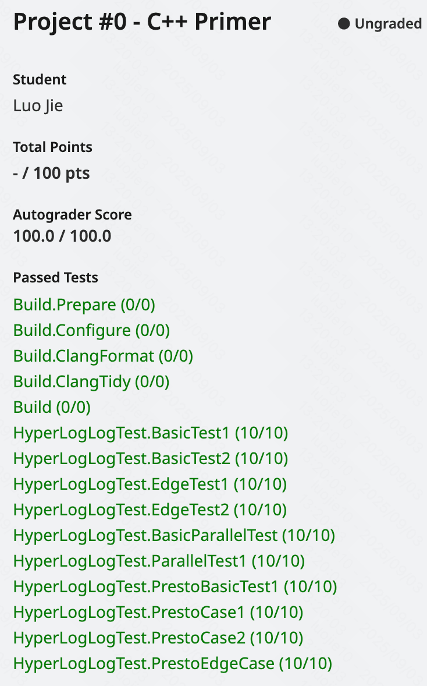

# CMU 15-445 (2024 fall) Project #0 - C++ Primer

>   封面来源：[@doggo_1d34](https://x.com/doggo_1d34/status/1961758941328945252)

[Project #0 - C++ Primer | CMU 15-445/645 :: Intro to Database Systems (Fall 2024)](https://15445.courses.cs.cmu.edu/fall2024/project0/)


引一个 [C++ 多线程的 slide](https://db.in.tum.de/teaching/ss23/c++praktikum/slides/lecture-10.2.pdf?lang=en)，过了一遍，感觉不错。

再引一些之前一直没学的 GDB，远古经典基础使用 [gdb Tutorial](https://www.cs.cmu.edu/~gilpin/tutorial/)、近期进阶使用 [GDB Tutorial: Essential GDB Tips to Learn Debugging](https://techbeamers.com/how-to-use-gdb-top-debugging-tips/)、大神表演 [CppCon 2015: Greg Law " Give me 15 minutes & I'll change your view of GDB" - YouTube](https://www.youtube.com/watch?v=PorfLSr3DDI)。

[cmu-db/15445-bootcamp](https://github.com/cmu-db/15445-bootcamp) 来作为现代 C++ 特性的学习也很不错。


提供的视频很好 [video](https://www.youtube.com/watch?v=lJYufx0bfpw)。

简单说下 HLL (HyperLogLog) 的算法原理：

伯努利原理，丢硬币的场景，00..01 的情况；

总共丢 n 次，丢 k 次第一次出现 1 的情况，最大一次是 ${k_{max}}$，那按照概率 $n = 2^{k_{max}}$；

回到我们要做的问题，是估计总共集合大小，hash 成 01串，一个 hash 算一个 k，然后统计 k_max 估计；
然后，为了降低误差，采用 分桶 bucket ，随机分配给多个统计 $k_{max_i}$；

然后求调和平均（缓解极端值），最后乘分桶数，再乘修正参数，是估计值。

分桶这一部分，把一段 01 作为选择桶的参数，然后剩余的 01 算 k。

（还有许多别的修正）

可以想到这个算法在数量少的时候，误差大，所以在大数据场景比较合适。

## Task #1

概念上，Left most one 是高位来的，需要统计到 1 这一位，most significant bit，即高位。

**位运算左移 / 右移位数**大于**被操作数的位数**时，是 ub (undefined behavior)，依赖编译器的处理，一般是取余、移动，但仍需要避免。

当使用 `bitset` 时，则是全 0，移动补 0 的处理。


测试时，注意删掉 `DISABLED_` 前缀，如 `DISABLED_BasicTest1` 变成 `BasicTest1`。

在测 Task #2 时，也可以把 Task #1 中耗时的测试重新加上 `DISABLED_`。

## Task #2

开始一直卡在不清楚各个部分的意义先列下我看到的帮助我理解的资料 / 聊天记录 / 注释，

再简单讲讲 Presto's HLL 中的 **dense layout implementation** 的算法原理：

主要参考 [HyperLogLog in Presto: Faster cardinality estimation - Engineering at Meta](https://engineering.fb.com/2018/12/13/data-infrastructure/hyperloglog/)（介绍了算法的发展历程）

```bash
# discord - p0-2024-fall - vittilad — 2024/9/4 18:34

1. Count the zeros from the right (this is the Rj in the cardinality computation). Also find the dense bucket index.

2. Reconstruct the curently stored Rj for the bucket. (See step 4 how to do). Compare to determine if you need to overwrite the stored bucket value.

3. Store the 4 least significant bits of Rj binary representation in the dense array (and the 3 bits remaining in the overflow but only if they are not all zero, overflow bucket is a map from dense bucket index to thos 3 bits)

4. When computing cardinality, you need to reconstruct the Rj from the dense/overflow storage. The 3 lower bits come from dense bucket and if there is an entry for the bucket index in overflow bucket you need to that into account.

# discord - p0-2024-fall - shengdao - 2024/12/15 11:00
According to my understanding, in the presto implementation of HLL, the high p bits are taken as the common bucket number, recorded as bucket_index. Take the LSB as the value. If the LSB exceeds the bucket width (DENSE_BUCKET_SIZE), it needs to be placed in the overflow bucket. The high 3 bits (OVERFLOW_BUCKET_SIZE) are placed in the overflow bucket and stored in the form of (bucket_index,xxx). The remaining low 4 bits (DENSE_BUCKET_SIZE) are placed in the corresponding common bucket. When calculating the cardinality, traverse densebucket. If there is a corresponding value in the overflow bucket, take the maximum value of the two and calculate according to the formula to obtain the cardinality.

If my understanding is correct, when calculating the cardinality, CONSTANTmm/sum, the minimum sum can be about 2^(-15), and it will not calculate such a large cardinality, just like where I made a mistake. I would like to ask, what are the mistakes and omissions I made?

# discord - p0-2024-fall - EvanHuang — 2024/12/21 01:13
you are supposed to combine bits from dense and overflow into the original number
```

注释中，`dense_bucket_` **Structure holding dense buckets (or also known as registers)**。

~~应该好好读注释的，我卡了好久 QnQ~~


（不保证正确，欢迎修正）

`n_leading_bits` 仍然和 Task #1 一致，是用于桶编号的位数。

桶的内容存储有区别，应该是考虑到大多数的值 LSBs 的 0，是比较小的，即 `DENSE_BUCKET_SIZE` 就够了。

然后对于超出 `DENSE_BUCKET_SIZE` 的部分，使用哈希映射分配 `OVERFLOW_BUCKET_SIZE`，显然就足够最大 64 位 0 了。

所以是为了节省一点空间。（？）

## 提交结果

