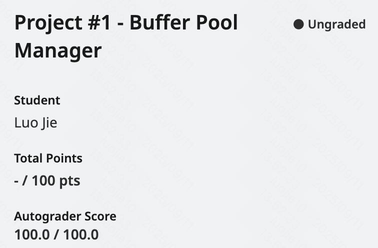
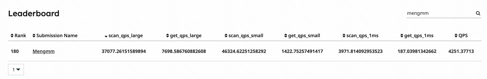

# CMU 15-445 (2024 fall) Project #1 - Buffer Pool Manager

> 封面来源：[@psychoron](https://x.com/psychoron/status/1868253168645349484)

[Project #1 - Buffer Pool Manager | CMU 15-445/645 :: Intro to Database Systems (Fall 2024)](https://15445.courses.cs.cmu.edu/fall2024/project1/)

实现的 BusTub 是面向磁盘的 DBMS，数据存储在 non-volatile disk 中。

BusTub 的 page 是固定大小 4 KB，

缓存池管理器 Buffer Pool Manager 存储 store 页到固定大小的 buffer 中，称为 frame。

把逻辑页 logical page 存储到物理固定帧 physical fixed frame 中。

作为 cache 也作为提供 DBMS 支持大于内存大小的数据库的管理。

实现需要是线程安全的，使用 [latches](https://stackoverflow.com/a/42464336) 来保证。

和 OS 的 lock 的区别大概是保护内部数据的关键部分，且不需要支持回滚 rollback change。

## Task #1 - LRU-K Replacement Policy

`size_t` 是 `unsigned` 默认值不要赋 `-1`。

别的就正常实现，线程安全，先都加大锁，后面再考虑优化。

## Task #2 - Disk Scheduler

了解 `std::promise` 和 `std::future`，简单理解是线程之间更加方便传递数据的方式。

关于 `std::promise` 和 `std::future` 的使用方式：

线程一，创建 promise 和 future，把 promise 传递给线程二（ref / move）；

线程一，获取值（等待，堵塞）；线程二，future 返回值，线程一继续。

另一个相关的是 `std::async`，对 `std::future` 和 `std::thread` （和 `std::packaged_task`）的封装。

`std::packaged_task` 也是类似。

值得注意的是，`std::future.get()` 的时候，会自动调用 wait，且只能调用一次 `get()`。

`std::async` 有不同的启动模式

- `std::launch::async` 异步
- `std::launch::deferred` 在 `get()`, `wait()` 的再去延迟执行
- `std::launch::async | std::launch::deferred` 默认，都可以，取决于编译器 / 操作系统（？）

如果 `std::future` 关联的 `std::promise` 在未被使用的时候，被释放了，会报错。

多个线程等待同一个执行结果时，可以使用 `std::shared_future`。

```cpp
// std::promise + std::future
void work(..., std::promise<int> work_promise) { // void, set_value()
  work_promise.set_value(xxx);
}

std::promise<int> work_promise;
std::future<int> work_future = work_promise.get_future();
std::thread work_thread(work, ..., std::move(work_promise));
// std::promise<int> &.., std::ref()

// std::async + std::future
std::future<int> future_ = std::async(func, [args]); // func -> int

// std::packaged_task + std::future
std::packaged_task<int(int,int)> task_(func); // func(int, int) -> int
std::future<int> future_ = task_.get_future();
std::thread thread_(std::move(task_), int, int);

auto ret = future_.get();
thread_.join();

// std::shared_future
std::shared_future<int> future_ = promise_.get_future();
// 在不同线程多次使用 future_
```

[cppreference std::promise](https://en.cppreference.com/w/cpp/thread/promise)

[C++之future和promise - PKICA - 博客园](https://www.cnblogs.com/guxuanqing/p/11360572.html)

[C++ 并发三剑客future, promise和async | 恋恋风辰的个人博客](https://www.limerence2017.com/2023/09/17/concpp07/)

虽然讲了很多，不过只要用一点点就行了。

## Task #3 - Buffer Pool Manager

主要调试的点：

（其实跟着 test case 就能出来）

- `Frame` 和 `Page` 的数据同步问题
- 同一个 `Frame`，读写的同步问题
- 逐出状态是跟着 `frame_id` 走的，构建时需要重置下
- 在 `frame` 的访问次数小于 `k` 时的比较方式和网页描述疑似不一致，是按照 FIFO 的方式？
- 就算是 `assert` 有使用到需要用锁的参数，也需要包含在锁的范围内，如 `LRUKReplacer::SetEvictable`。或者只在必要时才调用来缓解（不过应该不算彻底解决，但同时加上也是更合理的写法）。具体也不算搞清楚原因，**just work...**
- 试着让 `bpm` 和 `page_guard` 的职责分开。
- `frame` 的 `rw_latch` 需不需要锁。

```bash
# discord - p1-20224-fall - Rob c — 2025/4/9 09:05
literally staring at the same deadlock

I think that comment was added later on, and the fall 2024 code looked like this: https://github.com/cmu-db/bustub/blob/01a64ffdbad34b4bf0693096382c44e3107ba690/src/buffer/buffer_pool_manager.cpp

and the comment about taking the page lock was added in this PR https://github.com/cmu-db/bustub/commit/3e933255eff5600b8d083cca73ad583ec9f6e6a4

In the PR for that commit, #800, there's a devastating line:
Note that previously, the buffer pool manager only had unsafe flush methods.

Which imo seems like pretty good confirmation that we're not supposed to lock.

```

感觉是错哪改哪，后续还应该再去整理一遍的样子。

## 提交结果



Leaderboard 顺带贴一下吧，还没有做额外修改，也还没做 bonus 部分。

