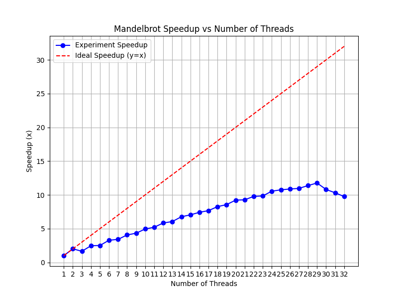
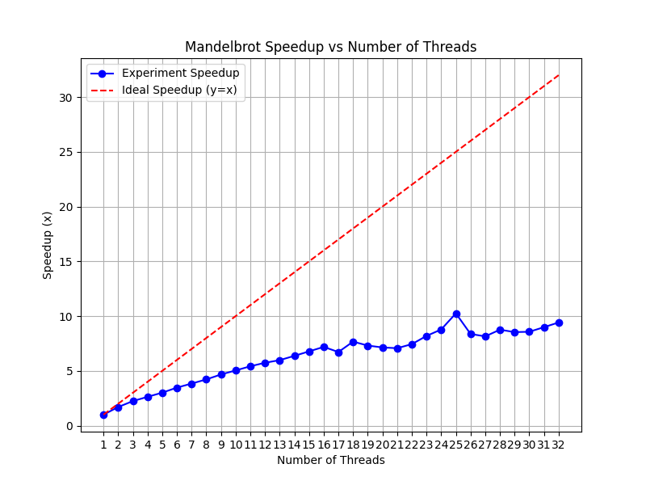
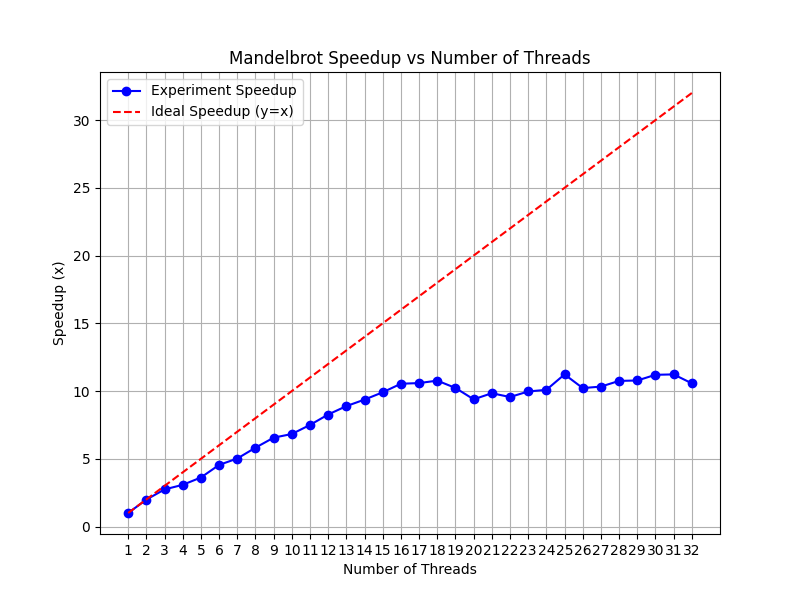
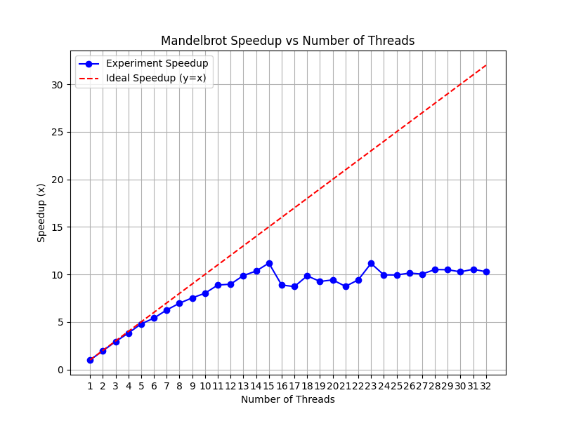

> 封面来源：[@ponkotuREIN](https://x.com/ponkotuREIN/status/1946846603106742776)

>   相关文章：[Stanford-CS149-并行计算-Assignment1-指南 - 知乎](https://zhuanlan.zhihu.com/p/7554656902)

## 环境

```bash
# 系统版本
uname -a
lsb_release -a
```

- OS: Windows11 - wsl2 (6.6.87.2-microsoft-standard-WSL2) - Ubuntu 22.04.5 LTS
- CPU: AMD Ryzen 7 6800H (8 cores, 16 logical processors, AVX2 256-bit)
- Python 3.10.12

## Prog1_mandelbrot_threads

由于笔者设备有 8x2 个逻辑处理器，为了实现原实验的效果（4x2 个逻辑处理器，最大 16 线程），将实验最大线程设为 32 线程。

优化前后的实验结果如下，前两张图为**连续等分**，第三张图为**连续不等分**，后两张为**交叉等分**。（具体耗时结果，可见prog1文件夹下csv文件）。










接下来，回答实验中的问题。

首先，针对加速比没有按照线程数的增长，线性增长。甚至，在图一中，3 线程效率低于 2 线程。

这是由于**连续等分**的划分方式，对于**稀疏运算**来说，不同线程的计算量不同，具体地，View 1 的结果如下。

```bash
NumThread: 3, Thread: 0, Time: 0.084 ms
NumThread: 3, Thread: 1, Time: 0.261 ms
NumThread: 3, Thread: 2, Time: 0.085 ms
```

可以发现 Thread 1 是瓶颈。

因此，我观察到图像上下对称，先尝试了**连续不均等分**，即上下两侧靠外的线程运算的区域大，中间的运算区域小，试图去平衡，各个线程中的计算量，虽然对比**连续等分**有明显进步，但仍然达不到实验要求。

再之后，根据相近的地方，计算量相似，使用**交叉等分**的方式划分，使得在到达 8 线程前几乎都是线性加速，Thread 8 达到 7.35x 的加速比。交叉间隔根据图形不同、线程数不同可以再调优。

不同方法，随着线程超过逻辑处理器后的变化，**连续等分**因为中间的线程负载还是很大，就是根据运算量最大的线程计算量减小而降低，最后到 29 最快，后面可能是因为划分的偏移，又导致峰值变高；**连续不等分**与**交叉等分**都是到超过逻辑处理器数量之后，基本维持在同一个加速比，由于划分的区别而产生波动，或因为切换上下文，性能略下降。

```cpp
// workerThreadStart 函数实现，三种方法
void workerThreadStart(WorkerArgs* const args) {
    // TODO FOR CS149 STUDENTS: Implement the body of the worker
    // thread here. Each thread should make a call to mandelbrotSerial()
    // to compute a part of the output image.  For example, in a
    // program that uses two threads, thread 0 could compute the top
    // half of the image and thread 1 could compute the bottom half.

    // printf("Hello world from thread %d\n", args->threadId);
    double startTime = CycleTimer::currentSeconds();

    // 1. thread 8 => 7.3x speedup
    constexpr unsigned int CHUNK_SIZE = 16;

    for (unsigned int startRow = args->threadId * CHUNK_SIZE;
         startRow < args->height; startRow += args->numThreads * CHUNK_SIZE) {
        int numRows = std::min(CHUNK_SIZE, args->height - startRow);
        mandelbrotSerial(args->x0, args->y0, args->x1, args->y1, args->width,
                         args->height, startRow, numRows, args->maxIterations,
                         args->output);
    }

    // 2. thread 8 => 5.8x speedup
    // int startRow = 0, nowRow = 0, tot = 0;
    // for (int i = 0; i < args->numThreads; i++) {
    //     int j = std::max(i + 1, args->numThreads - i);
    //     tot += j * j;
    //     if (i == args->threadId - 1)
    //         startRow = tot;
    //     else if (i == args->threadId)
    //         nowRow = tot;
    // }
    // double perThread = static_cast<double>(args->height) / tot;
    // startRow = static_cast<int>(startRow * perThread);
    // nowRow = static_cast<int>(nowRow * perThread);
    // int numRows = nowRow - startRow;
    // if (args->threadId == args->numThreads - 1)
    //     numRows = args->height - startRow;
    // mandelbrotSerial(args->x0, args->y0, args->x1, args->y1, args->width,
    //                  args->height, startRow, numRows, args->maxIterations,
    //                  args->output);

    // 3. thread 8 => 4.x speedup
    // int perThread = (args->height - 1) / args->numThreads + 1;
    // int startRow = args->threadId * perThread,
    //     numRows =
    //         std::min(perThread, static_cast<int>(args->height) - startRow);

    // printf("width: %d, height: %d, startRow: %d, numRows: %d\n", args->width,
    //        args->height, startRow, numRows);
    // mandelbrotSerial(args->x0, args->y0, args->x1, args->y1, args->width,
    //                  args->height, startRow, numRows, args->maxIterations,
    //                  args->output);

    double endTime = CycleTimer::currentSeconds();
    printf("NumThread: %d, Thread: %d, Time: %.3lf ms\n", args->numThreads,
           args->threadId, endTime - startTime);
}
```

## Prog2_vecintrin

观察`abs()`函数的实现，不难看出，`maskAll`的初始化存在问题，只有默认值，不能适应多种向量宽度；向量宽度必须是数组长度的因子。

做出如下修改（如需测试，解除`main()`函数中，相关的注释即可）：

```cpp
// void absVector(float* values, float* output, int N);
// All ones
// maskAll = _cs149_init_ones(); // original
maskAll = _cs149_init_ones(std::min(VECTOR_WIDTH, N - i));
```

而后参照`absVector()`函数实现中的`vecintrin`库函数的应用，照猫画虎。

其中值得注意的是标有`corner ???`注释的地方，由于库函数实现中，比较函数，未被`mask`掩盖（为0）时，是沿用**目标数组**的结果，所以会有需要初始化的地方。

建议多次、多试不同的参数，来测试（写个脚本最好，不过我懒了）。

同时也存在实际不影响的未初始化，比如`absVector()`中的`maskIsNegative`，后半部分，其实不是合法的，但是由于只会影响中间结果，不影响最后赋值的情况，所以，不需要额外处理。

```cpp
void clampedExpVector(float* values, int* exponents, float* output, int N) {
    //
    // CS149 STUDENTS TODO: Implement your vectorized version of
    // clampedExpSerial() here.
    //
    // Your solution should work for any value of
    // N and VECTOR_WIDTH, not just when VECTOR_WIDTH divides N
    //
    __cs149_vec_float x, result, oneFloat = _cs149_vset_float(1.f),
                                 ceiling = _cs149_vset_float(9.999999f);
    __cs149_vec_int y, count, zero = _cs149_vset_int(0),
                              oneInt = _cs149_vset_int(1);
    __cs149_mask maskAll, maskEqZero, maskNotEqZero, maskGtCeiling,
        maskCountGtZero;

    for (int i = 0; i < N; i += VECTOR_WIDTH) {
        // 全 1（且未越界）
        maskAll = _cs149_init_ones(std::min(VECTOR_WIDTH, N - i));
        _cs149_vload_float(x, values + i, maskAll);   // x = value[i];
        _cs149_vload_int(y, exponents + i, maskAll);  // y = exponents[i];
        // 等于 0（且未越界）
        maskEqZero = _cs149_init_ones(0);              // init corner ???
        _cs149_veq_int(maskEqZero, y, zero, maskAll);  // if (y == 0) {
        _cs149_vstore_float(output + i, oneFloat,
                            maskEqZero);  // output[i] = 1.f;
        // 不等于 0（且未越界）
        maskNotEqZero = _cs149_mask_not(maskEqZero);  // if (y != 0) {
        maskNotEqZero = _cs149_mask_and(maskNotEqZero, maskAll);  // corner ???
        _cs149_vmove_float(result, x, maskNotEqZero);             // result = x;
        count = _cs149_vset_int(0);                               // init ???
        _cs149_vsub_int(count, y, oneInt, maskNotEqZero);  // count = y - 1;
        maskCountGtZero = _cs149_init_ones(0);             // corner ???
        _cs149_vgt_int(maskCountGtZero, count, zero, maskNotEqZero);
        while (_cs149_cntbits(maskCountGtZero) > 0) {  // while (count > 0) {
            _cs149_vmult_float(result, result, x,
                               maskCountGtZero);  // result *= x;
            _cs149_vsub_int(count, count, oneInt, maskCountGtZero);  // count--;
            _cs149_vgt_int(maskCountGtZero, count, zero, maskNotEqZero);
        }
        // 大于上界值（且未越界）
        // maskGtCeiling = _cs149_init_ones(0);  // corner ??? can remove.
        _cs149_vgt_float(maskGtCeiling, result, ceiling,
                         maskNotEqZero);  // if (result > 9.999999f) {
        _cs149_vmove_float(result, ceiling,
                           maskGtCeiling);  // result = 9.999999f;
        _cs149_vstore_float(output + i, result,
                            maskNotEqZero);  // output[i] = result;
    }
}
```

然后是实验要求第二点所要求的测试。

发现随着`VECTOR_WIDTH`增大，`vector utilization`减小。

在测试设置的参数下，向量位宽都是长度的因子，不存在浪费增多的问题。

观察到计算方式是`(double)stats.utilized_lane/stats.total_lane*100`，也就是输出`log`时，活跃的`*`和不活跃的`_`之比，猜测是向量位宽越长，出现发散Divergence的概率越大。

```bash
# Test ./myexp -s 10000
# 测试时只实现了CLAMPED EXPONENT，忽略ARRAY SUM的结果

Vector_Width = 2:

CLAMPED EXPONENT (required) 
Results matched with answer!
****************** Printing Vector Unit Statistics *******************
Vector Width:              2
Total Vector Instructions: 172728
Vector Utilization:        83.8%
Utilized Vector Lanes:     289354
Total Vector Lanes:        345456
************************ Result Verification *************************
Passed!!!

ARRAY SUM (bonus) 
Expected 9825.218750, got 0.000000
.@@@ Failed!!!
Vector_Width = 4:
CLAMPED EXPONENT (required) 
Results matched with answer!
****************** Printing Vector Unit Statistics *******************
Vector Width:              4
Total Vector Instructions: 99576
Vector Utilization:        78.6%
Utilized Vector Lanes:     313250
Total Vector Lanes:        398304
************************ Result Verification *************************
Passed!!!

ARRAY SUM (bonus) 
Expected 9825.218750, got 0.000000
.@@@ Failed!!!

Vector_Width = 8:

CLAMPED EXPONENT (required) 
Results matched with answer!
****************** Printing Vector Unit Statistics *******************
Vector Width:              8
Total Vector Instructions: 54128
Vector Utilization:        76.0%
Utilized Vector Lanes:     329300
Total Vector Lanes:        433024
************************ Result Verification *************************
Passed!!!

ARRAY SUM (bonus) 
Expected 9825.218750, got 0.000000
.@@@ Failed!!!

Vector_Width = 16:

CLAMPED EXPONENT (required) 
Results matched with answer!
****************** Printing Vector Unit Statistics *******************
Vector Width:              16
Total Vector Instructions: 28218
Vector Utilization:        74.9%
Utilized Vector Lanes:     337955
Total Vector Lanes:        451488
************************ Result Verification *************************
Passed!!!

ARRAY SUM (bonus) 
Expected 9825.218750, got 0.000000
.@@@ Failed!!!

```

最后是`arraySumVector()`，实现比较简单，主要是**并行归约/树形归约**的优化，在这里优化其实是很小的常数，但是在**CUDA**编程中，在**Reduce归约求和**的情境下涉及更多，包括如何优化线程利用率、解决 Bank conflict 等问题。

```cpp
// returns the sum of all elements in values
// You can assume N is a multiple of VECTOR_WIDTH
// You can assume VECTOR_WIDTH is a power of 2
float arraySumVector(float* values, int N) {
    //
    // CS149 STUDENTS TODO: Implement your vectorized version of arraySumSerial
    // here
    //

    // 实验保证向量位宽是 N 的因子

    // O(N / VECTOR_WIDTH)
    __cs149_vec_float sum = _cs149_vset_float(0.f), tmp;
    __cs149_mask maskAll = _cs149_init_ones(VECTOR_WIDTH);
    for (int i = 0; i < N; i += VECTOR_WIDTH) {
        _cs149_vload_float(tmp, values + i, maskAll);
        _cs149_vadd_float(sum, sum, tmp, maskAll);
    }

    // 1. O(VECTOR_WIDTH)
    // float result = 0.f;
    // for (int i = 0; i < VECTOR_WIDTH; i++) {
    //     result += sum.value[i];
    // }
    // return result;

    // 2. O(log2(VECTOR_WIDTH))
    // 并行归约 / 树形归约
    for (int s = VECTOR_WIDTH / 2; s > 0; s >>= 1) {
        _cs149_hadd_float(tmp, sum);
        _cs149_interleave_float(sum, tmp);
    }
    return sum.value[0];
}
```

## prog3_mandelbrot_ispc

任务是优化性能问题。

### Part 1.

```bash
# ./mandelbrot_ispc -t      
[mandelbrot serial]:            [214.754] ms
Wrote image file mandelbrot-serial.ppm
[mandelbrot ispc]:              [36.824] ms
Wrote image file mandelbrot-ispc.ppm
[mandelbrot multicore ispc]:    [18.593] ms
Wrote image file mandelbrot-task-ispc.ppm
                                (5.83x speedup from ISPC)
                                (11.55x speedup from task ISPC)

# ./mandelbrot_ispc -t -v 2 
[mandelbrot serial]:            [129.845] ms
Wrote image file mandelbrot-serial.ppm
[mandelbrot ispc]:              [26.140] ms
Wrote image file mandelbrot-ispc.ppm
[mandelbrot multicore ispc]:    [15.506] ms
Wrote image file mandelbrot-task-ispc.ppm
                                (4.97x speedup from ISPC)
                                (8.37x speedup from task ISPC)
```

理论加速比为 8，但实际不到 6 倍。

同时，**view 2**的效果比**view 1**差。（view 2 更加分散）

推测是，在一个 SIMD 中，有些数据结束得快，有的结束得慢，导致控制流发散Divergence，并且，局部越不同，效果越差。

### Part 2.

如 Part 1. 列出的结果，--tasks 加速比多一倍（view 1）。

只修改`mandelbrot_ispc_withtasks()`的`taskCount`，由于只修改此函数，不修改内部函数，不是图像高度的因子，会产生越界等情况。

```bash
# taskCount = 2
# ./mandelbrot_ispc -t      
[mandelbrot serial]:            [214.754] ms
Wrote image file mandelbrot-serial.ppm
[mandelbrot ispc]:              [36.824] ms
Wrote image file mandelbrot-ispc.ppm
[mandelbrot multicore ispc]:    [18.593] ms
Wrote image file mandelbrot-task-ispc.ppm
                                (5.83x speedup from ISPC)
                                (11.55x speedup from task ISPC)

# taskCount = 4
(14.50x speedup from task ISPC)

# taskCount = 8
(23.71x speedup from task ISPC)

# taskCount = 16
(41.14x speedup from task ISPC)

# taskCount = 32
# ./mandelbrot_ispc -t
(64.76x speedup from task ISPC)

# taskCount = 50
# ./mandelbrot_ispc -t
(56.79x speedup from task ISPC)
```

测试下来 32 是最好的，因为曼德博集合计算量不均，所以，32 比逻辑处理器数量 16 还会大约 50% 的增长，能更加均衡。

直觉上会认为切得越碎应该加速效果会进一步提升，但实际上可能由于再增加，使得**负载又不均衡**了，同时也会增加**调度的开销**，加速比又下降了。

因为我的逻辑处理器是实验要求的两倍，实验要求 32 倍加速，我这里获得 64 倍加速，应该也是合格了。


线程抽象 Thread Abstraction 和 ISPC 的 任务抽象 Task Abstraction，线程/任务数很多的话（如 10,000），线程抽象创建线程的开销大，而任务抽象能自动分配线程。（？）

`foreach`是 SIMD 层级的抽象，`launch`是 Cores 层级的抽象。

## Prog4_sqrt

给定实现的测试结果，SIMD 加速 5x，Multi-Core 加速 11.6x ：

```bash
# ./sqrt
[sqrt serial]:          [915.247] ms
[sqrt ispc]:            [184.232] ms
[sqrt task ispc]:       [15.848] ms
                                (4.97x speedup from ISPC)
                                (57.75x speedup from task ISPC)
                                (11.6x)
```

```cpp
for (unsigned int i = 0; i < N; i++) {
    // TODO: CS149 students.  Attempt to change the values in the
    // array here to meet the instructions in the handout: we want
    // to you generate best and worse-case speedups

    // starter code populates array with random input values
    values[i] = .001f + 2.998f * static_cast<float>(rand()) / RAND_MAX;
    // values[i] = 1.f;
    // values[i] = 2.999f;
    // values[i] = ((i % 8) ? 1.f : 2.999f);
}
```

```bash
# 初始化 0.001f
[sqrt serial]:          [796.618] ms
[sqrt ispc]:            [137.250] ms
[sqrt task ispc]:       [12.865] ms
                                (5.80x speedup from ISPC)
                                (61.92x speedup from task ISPC)
                                (10.7x)

# 初始化 1.0f
[sqrt serial]:          [14.291] ms
[sqrt ispc]:            [9.292] ms
[sqrt task ispc]:       [6.772] ms
                                (1.54x speedup from ISPC)
                                (2.11x speedup from task ISPC)
                                (1.4x)

# 初始化 2.999f
[sqrt serial]:          [1921.892] ms
[sqrt ispc]:            [289.794] ms
[sqrt task ispc]:       [24.470] ms
                                (6.63x speedup from ISPC)
                                (78.54x speedup from task ISPC)
                                (11.8x)
                                

# 初始化 七个 1.f 和 一个 2.999f 一组，即 values[i] = ((i % 8) ? 1.f : 2.999f);
[sqrt serial]:          [262.380] ms
[sqrt ispc]:            [289.699] ms
[sqrt task ispc]:       [24.079] ms
                                (0.91x speedup from ISPC)
                                (10.90x speedup from task ISPC)
                                (12.0x)
```

有上述结果可以看出：

SIMD 并行效果最差是分散且大部分都是 lanes 都是空闲的情况下，最好是不分散且计算量大的时候；

Multi-Core 并行效果最差是计算量小的时候，此时线程启动开销大（猜测）。

AVX2 实现一版，因为不熟悉相关指令，基本是让 AI 写对照串行代码，写了一版，然后改了改错。

主要涉及，标量常量转换为向量常量、向量乘、向量减、向量与、向量比较的指令。

```cpp
// 导入相关库
#include <immintrin.h>

void sqrt_my_avx2(int N, float initialGuess, float* values, float* output) {
    static const float kThreshold = 0.00001f;
    const __m256 initialGuess_v = _mm256_set1_ps(initialGuess);
    const __m256 kThreshold_v = _mm256_set1_ps(kThreshold);
    const __m256 one_v = _mm256_set1_ps(1.f);
    const __m256 three_v = _mm256_set1_ps(3.f);
    const __m256 half_v = _mm256_set1_ps(0.5f);

    // 做与操作，实现取绝对值
    const __m256 abs_mask_v =
        _mm256_castsi256_ps(_mm256_set1_epi32(0x7FFFFFFF));

    for (int i = 0; i <= N - 8; i += 8) {
        __m256 x = _mm256_loadu_ps(values + i);
        __m256 guess = initialGuess_v;

        __m256 continue_mask;

        while (true) {
            __m256 guess_sq = _mm256_mul_ps(guess, guess);
            __m256 term = _mm256_mul_ps(guess_sq, x);
            __m256 error =
                _mm256_and_ps((_mm256_sub_ps(term, one_v)), abs_mask_v);

            continue_mask = _mm256_cmp_ps(error, kThreshold_v, _CMP_GT_OQ);

            if (_mm256_movemask_ps(continue_mask) == 0) {
                break;
            }

            __m256 guess_cubed = _mm256_mul_ps(guess_sq, guess);
            __m256 term2 = _mm256_mul_ps(x, guess_cubed);
            __m256 term3 = _mm256_mul_ps(three_v, guess);
            __m256 new_guess_unscaled = _mm256_sub_ps(term3, term2);
            __m256 new_guess = _mm256_mul_ps(new_guess_unscaled, half_v);

            guess = _mm256_blendv_ps(guess, new_guess, continue_mask);
        }

        __m256 result = _mm256_mul_ps(x, guess);
        _mm256_storeu_ps(output + i, result);
    }
}

// main()

// My version of AVX2

double minMyAVX2 = 1e30;
for (int i = 0; i < 3; ++i) {
    double startTime = CycleTimer::currentSeconds();
    sqrt_my_avx2(N, initialGuess, values, output);
    double endTime = CycleTimer::currentSeconds();
    minMyAVX2 = std::min(minMyAVX2, endTime - startTime);
}

printf("[sqrt my avx2]:\t\t[%.3f] ms\n", minMyAVX2 * 1000);

verifyResult(N, output, gold);

// Clear out the buffer
for (unsigned int i = 0; i < N; ++i) output[i] = 0;


printf("\t\t\t\t(%.2fx speedup from My AVX2)\n", minSerial / minMyAVX2);
```

最后结果是优于 ispc 的版本。

```bash
# 随机数据
[sqrt serial]:          [917.327] ms
[sqrt ispc]:            [186.708] ms
[sqrt my avx2]:         [155.992] ms
[sqrt task ispc]:       [16.230] ms
                                (4.91x speedup from ISPC)
                                (5.88x speedup from My AVX2)
                                (56.52x speedup from task ISPC)

# values[i] = 1.f;
[sqrt serial]:          [14.391] ms
[sqrt ispc]:            [9.552] ms
[sqrt my avx2]:         [8.411] ms
[sqrt task ispc]:       [6.627] ms
                                (1.51x speedup from ISPC)
                                (1.71x speedup from My AVX2)
                                (2.17x speedup from task ISPC)

# values[i] = 2.999f;
[sqrt serial]:          [1922.672] ms
[sqrt ispc]:            [290.222] ms
[sqrt my avx2]:         [214.912] ms
[sqrt task ispc]:       [24.780] ms
                                (6.62x speedup from ISPC)
                                (8.95x speedup from My AVX2)
                                (77.59x speedup from task ISPC)

# values[i] = ((i % 8) ? 1.f : 2.999f);
[sqrt serial]:          [267.990] ms
[sqrt ispc]:            [291.000] ms
[sqrt my avx2]:         [212.485] ms
[sqrt task ispc]:       [27.419] ms
                                (0.92x speedup from ISPC)
                                (1.26x speedup from My AVX2)
                                (9.77x speedup from task ISPC)
```

## Prog5_saxpy

```bash
# ./saxpy
[saxpy ispc]:           [11.335] ms     [26.292] GB/s   [3.529] GFLOPS
[saxpy task ispc]:      [8.950] ms      [33.299] GB/s   [4.469] GFLOPS
                                (1.27x speedup from use of tasks)

# 取消注释掉后的完整输出
[saxpy serial]:         [12.749] ms     [23.376] GB/s   [3.137] GFLOPS
[saxpy ispc]:           [11.794] ms     [25.269] GB/s   [3.392] GFLOPS
[saxpy task ispc]:      [9.080] ms      [32.821] GB/s   [4.405] GFLOPS
                                (1.30x speedup from use of tasks)
                                (1.08x speedup from ISPC)
                                (1.40x speedup from task ISPC)
```

tasks 只加速了 1.27x，猜测是卡在 IO 上（内存带宽密集型任务，Memory-Bound），单个计算量不算大，两种方式的加速都很有限。

因为卡在内存带宽上，无法通过优化代码来接近线性加速。


**写分配 (Write-Allocate)** 机制，写未命中、分配并读取（写入的缓存行）。


为了优化saxpy程序，我们要考虑解决内存带宽的瓶颈。

1. 对于实际 result 只写入，不会读取的写入操作，不做标准写操作的读入缓存行的操作，而是直接写在主内存中
2. 预取数据（**未实现**）

具体地，用 AVX2 实现了以下内容（由于这些指令需要对齐内存，所以申请内存的方式统一修改）：

```makefile
# 在原本的 CXXFLAGS 中加入对 avx2 的支持
CXXFLAGS=-I../common -Iobjs/ -O2 -Wall -mavx2
```

代码实现：

```cpp
// main.cpp

#include <immintrin.h>


// stream_ps，直接写入主内存
static void saxpy_avx2(int N, float scale, float* X, float* Y, float* result) {
    const __m256 scale_v = _mm256_set1_ps(scale);

    int i = 0;
    for (; i <= N - 8; i += 8) {
        __m256 x = _mm256_load_ps(X + i), y = _mm256_load_ps(Y + i);
        __m256 res = _mm256_add_ps(_mm256_mul_ps(scale_v, x), y);
        _mm256_stream_ps(result + i, res);
    }
    for (; i < N; i++) {
        result[i] = scale * X[i] + Y[i];
    }
}
/**********************************************************************
[saxpy serial]:         [12.063] ms     [24.705] GB/s   [3.316] GFLOPS
[saxpy avx2]:           [6.954] ms      [42.859] GB/s   [5.752] GFLOPS
[saxpy ispc]:           [11.196] ms     [26.618] GB/s   [3.573] GFLOPS
[saxpy task ispc]:      [9.088] ms      [32.792] GB/s   [4.401] GFLOPS
                                (1.73x speedup from My AVX2)
                                (1.23x speedup from use of tasks)
                                (1.08x speedup from ISPC)
                                (1.33x speedup from task ISPC)
**********************************************************************/


// main()
const int ALIGNMENT = 32;

float* arrayX = (float*)_mm_malloc(N * sizeof(float), ALIGNMENT);
float* arrayY = (float*)_mm_malloc(N * sizeof(float), ALIGNMENT);
float* resultSerial = (float*)_mm_malloc(N * sizeof(float), ALIGNMENT);
float* resultISPC = (float*)_mm_malloc(N * sizeof(float), ALIGNMENT);
float* resultTasks = (float*)_mm_malloc(N * sizeof(float), ALIGNMENT);
float* resultAVX2 = (float*)_mm_malloc(N * sizeof(float), ALIGNMENT);

// My AVX2 version

double minAVX2 = 1e30;
for (int i = 0; i < 3; ++i) {
    double startTime = CycleTimer::currentSeconds();
    saxpy_avx2(N, scale, arrayX, arrayY, resultAVX2);
    double endTime = CycleTimer::currentSeconds();
    minAVX2 = std::min(minAVX2, endTime - startTime);
}

verifyResult(N, resultAVX2, resultSerial);

printf("[saxpy avx2]:\t\t[%.3f] ms\t[%.3f] GB/s\t[%.3f] GFLOPS\n",
       minAVX2 * 1000, toBW(TOTAL_BYTES, minAVX2),
       toGFLOPS(TOTAL_FLOPS, minAVX2));

printf("\t\t\t\t(%.2fx speedup from My AVX2)\n", minSerial / minAVX2);

_mm_free(arrayX);
_mm_free(arrayY);
_mm_free(resultAVX2);
_mm_free(resultSerial);
_mm_free(resultISPC);
_mm_free(resultTasks);
```

从结果上，相比 ISPC 实现，还是有不小的提升的。

## Prog6_kmeans

找**性能热点** Performance hotspot。

- 修一些`new []`的内存，使用`delete[]`而非`free()`。
- 修`requirements.txt`，`matplotlib`需要更高级（我安装的3.10.3），适配 Numpy 2，或者就按照文件的版本强制符合。

约 800MB 的用于 grade 的`data.dat`没有开源给出，但是代码中也给出了 "for fun" 的代码，用于自主测试。

生成完`data.dat`后，再次注释掉，使用`readData()`。

M 个 N 维 K 个中心的数据。

```cpp
// main.cpp

// readData("./data.dat", &data, &clusterCentroids, &clusterAssignments, &M, &N, &K, &epsilon);

// NOTE: if you want to generate your own data (for fun), you can use the below code
M = 1e6;
N = 100;
K = 3;
epsilon = 0.1;

data = new double[M * N];
clusterCentroids = new double[K * N];
clusterAssignments = new int[M];

// Initialize data
initData(data, M, N);
initCentroids(clusterCentroids, K, N);

// Initialize cluster assignments
for (int m = 0; m < M; m++) {
    double minDist = 1e30;
    int bestAssignment = -1;
    for (int k = 0; k < K; k++) {
        double d = dist(&data[m * N], &clusterCentroids[k * N], N);
        if (d < minDist) {
            minDist = d;
            bestAssignment = k;
        }
    }
    clusterAssignments[m] = bestAssignment;
}

// Uncomment to generate data file
writeData("./data.dat", data, clusterCentroids, clusterAssignments, &M, &N, &K, &epsilon);
```

```bash
# 默认生成，测试
# ./kmeans
Running K-means with: M=1000000, N=100, K=3, epsilon=0.100000
[Total Time]: 9421.894 ms
```

```cpp
// kmeansThread.cpp
double tot1 = 0.f, tot2 = 0.f, tot3 = 0.f;

// while (!stoppingConditionMet(prevCost, currCost, epsilon, K)) {
    double t1 = CycleTimer::currentSeconds();
    computeAssignments(&args);
    double t2 = CycleTimer::currentSeconds();
    computeCentroids(&args);
    double t3 = CycleTimer::currentSeconds();
    computeCost(&args);
    double t4 = CycleTimer::currentSeconds();
// }
tot1 += t2 - t1;
tot2 += t3 - t2;
tot3 += t4 - t3;

iter = std::max(iter, 1);
tot1 /= iter, tot2 /= iter, tot3 /= iter;
double sum = tot1 + tot2 + tot3;

printf("cost per iteration:\n");
printf("compute Assignments:\t[%.2lf] ms\n", tot1 * 1000);
printf("\t\tout of all: [%.2lf] %%\n", tot1 / sum * 100);
printf("compute Centroids:\t[%.2lf] ms\n", tot2 * 1000);
printf("\t\tout of all: [%.2lf] %%\n", tot2 / sum * 100);
printf("compute Cost:\t\t[%.2lf] ms\n", tot3 * 1000);
printf("\t\tout of all: [%.2lf] %%\n", tot3 / sum * 100);
```

结果：

```bash
# 分析性能瓶颈
Running K-means with: M=1000000, N=100, K=3, epsilon=0.100000
cost per iteration:
compute Assignments:    [261.63] ms
                out of all: [65.42] %
compute Centroids:      [64.91] ms
                out of all: [16.23] %
compute Cost:           [73.35] ms
                out of all: [18.34] %
[Total Time]: 9597.698 ms
```

要达到 2.1x 加速比，重点优化`computeAssignments()`，其中，为了避免多线程之间的冲突，需要对函数内部进行调整。

```cpp
// kmeansThread.cpp

void computeAssignments(WorkerArgs *const args) {
    double *minDist = new double[args->M];

    // Initialize arrays
    // for (int m = 0; m < args->M; m++) {
    for (int m = args->start; m < args->end; m++) {
        minDist[m] = 1e30;
        args->clusterAssignments[m] = -1;
    }

    // Assign datapoints to closest centroids
    // for (int k = args->start; k < args->end; k++) {
    //     for (int m = 0; m < args->M; m++) {
    for (int k = 0; k < args->K; k++) {
        for (int m = args->start; m < args->end; m++) {
            double d = dist(&args->data[m * args->N],
                            &args->clusterCentroids[k * args->N], args->N);
            if (d < minDist[m]) {
                minDist[m] = d;
                args->clusterAssignments[m] = k;
            }
        }
    }

    // free(minDist);
    delete[] minDist;
}

// kMeansThread();
static constexpr int numThreads = 8;

int perThread = M / numThreads;

WorkerArgs args[numThreads];
for (int i = 0; i < numThreads; i++) {
    args[i].data = data;
    args[i].clusterCentroids = clusterCentroids;
    args[i].clusterAssignments = clusterAssignments;
    args[i].currCost = currCost;
    args[i].M = M;
    args[i].N = N;
    args[i].K = K;
    args[i].start = i * perThread;
    args[i].end = std::min((i + 1) * perThread, M);
}

std::thread workers[numThreads];

// while (!stoppingConditionMet(prevCost, currCost, epsilon, K)) {
double t1 = CycleTimer::currentSeconds();
for (int i = 1; i < numThreads; i++) {
    workers[i] = thread(computeAssignments, &args[i]);
}
computeAssignments(&args[0]);
for (int i = 1; i < numThreads; i++) {
    workers[i].join();
}
double t2 = CycleTimer::currentSeconds();

args[0].start = 0;
args[0].end = K;
computeCentroids(&args[0]);
double t3 = CycleTimer::currentSeconds();
computeCost(&args[0]);
double t4 = CycleTimer::currentSeconds();
// }
```

在做出以上`computeAssignments()`的修改后，八线程加速开销最大的一部分，已达成 **2.21x** 的加速比。

后续测试`numThreads`为 4 或 16，效果均不如 8，推测是**线程启动开销**等原因。

```bash
# numThreads = 8
Running K-means with: M=1000000, N=100, K=3, epsilon=0.100000
cost per iteration:
compute Assignments:    [60.94] ms
                out of all: [32.30] %
compute Centroids:      [52.40] ms
                out of all: [27.78] %
compute Cost:           [75.29] ms
                out of all: [39.91] %
[Total Time]: 4338.599 ms
```

（后来才看到**限制Constraints**中提到并行化`dist`, `computeAssignments`, `computeCentroids`, `computeCost`其中一个，反正按照上面的挑选上来说，也是选`computeAssignments`。

另外几个函数的优化方法类似，建议考虑 M N K 的量级，来权衡开销，有的需要函数内部实现多线程，因为后续有依赖关系，所以就懒得实现了，这里不在给出了代码。）

以下给出完整代码：

```cpp
void computeAssignments(WorkerArgs *const args) {
    double *minDist = new double[args->M];

    // Initialize arrays
    // for (int m = 0; m < args->M; m++) {
    for (int m = args->start; m < args->end; m++) {
        minDist[m] = 1e30;
        args->clusterAssignments[m] = -1;
    }

    // Assign datapoints to closest centroids
    // for (int k = args->start; k < args->end; k++) {
    //     for (int m = 0; m < args->M; m++) {
    for (int k = 0; k < args->K; k++) {
        for (int m = args->start; m < args->end; m++) {
            double d = dist(&args->data[m * args->N],
                            &args->clusterCentroids[k * args->N], args->N);
            if (d < minDist[m]) {
                minDist[m] = d;
                args->clusterAssignments[m] = k;
            }
        }
    }

    // free(minDist);
    delete[] minDist;
}

void kMeansThread(double *data, double *clusterCentroids,
                  int *clusterAssignments, int M, int N, int K,
                  double epsilon) {
    // Used to track convergence
    double *prevCost = new double[K];
    double *currCost = new double[K];

    // The WorkerArgs array is used to pass inputs to and return output from
    // functions.
    static constexpr int numThreads = 8;

    int perThread = M / numThreads;

    WorkerArgs args[numThreads];
    for (int i = 0; i < numThreads; i++) {
        args[i].data = data;
        args[i].clusterCentroids = clusterCentroids;
        args[i].clusterAssignments = clusterAssignments;
        args[i].currCost = currCost;
        args[i].M = M;
        args[i].N = N;
        args[i].K = K;
        args[i].start = i * perThread;
        args[i].end = std::min((i + 1) * perThread, M);
    }

    // Initialize arrays to track cost
    for (int k = 0; k < K; k++) {
        prevCost[k] = 1e30;
        currCost[k] = 0.0;
    }

    double tot1 = 0.f, tot2 = 0.f, tot3 = 0.f;
    std::thread workers[numThreads];

    /* Main K-Means Algorithm Loop */
    int iter = 0;
    while (!stoppingConditionMet(prevCost, currCost, epsilon, K)) {
        // Update cost arrays (for checking convergence criteria)
        for (int k = 0; k < K; k++) {
            prevCost[k] = currCost[k];
        }

        // Setup args struct
        // args.start = 0;
        // args.end = K;
        // computeAssignments(&args);
        double t1 = CycleTimer::currentSeconds();
        for (int i = 1; i < numThreads; i++) {
            workers[i] = thread(computeAssignments, &args[i]);
        }
        computeAssignments(&args[0]);
        for (int i = 1; i < numThreads; i++) {
            workers[i].join();
        }

        args[0].start = 0;
        args[0].end = K;

        double t2 = CycleTimer::currentSeconds();
        computeCentroids(&args[0]);
        double t3 = CycleTimer::currentSeconds();
        computeCost(&args[0]);
        double t4 = CycleTimer::currentSeconds();

        tot1 += t2 - t1;
        tot2 += t3 - t2;
        tot3 += t4 - t3;

        iter++;
    }

    iter = std::max(iter, 1);
    tot1 /= iter, tot2 /= iter, tot3 /= iter;
    double sum = tot1 + tot2 + tot3;

    printf("cost per iteration:\n");
    printf("compute Assignments:\t[%.2lf] ms\n", tot1 * 1000);
    printf("\t\tout of all: [%.2lf] %%\n", tot1 / sum * 100);
    printf("compute Centroids:\t[%.2lf] ms\n", tot2 * 1000);
    printf("\t\tout of all: [%.2lf] %%\n", tot2 / sum * 100);
    printf("compute Cost:\t\t[%.2lf] ms\n", tot3 * 1000);
    printf("\t\tout of all: [%.2lf] %%\n", tot3 / sum * 100);

    // free(currCost);
    // free(prevCost);
    delete[] currCost;
    delete[] prevCost;
}
```

## 扩展阅读

> IMHO it's a must read for CS149 students!

[The story of ispc: all the links](https://pharr.org/matt/blog/2018/04/30/ispc-all)

~~咕咕中，如果去看完了，可能会出个 note 或翻译版？~~

原始实验材料仓库：[stanford-cs149/asst1 at 308e409ff3b75796702ca2cb0905bad0db752405](https://github.com/stanford-cs149/asst1/tree/308e409ff3b75796702ca2cb0905bad0db752405)

我的实现仓库：[Livinfly/15-418u15-618uCS149u: Notes & assignments implements for 15-418 / 15-618 / CS149](https://github.com/Livinfly/15-418u15-618uCS149u)