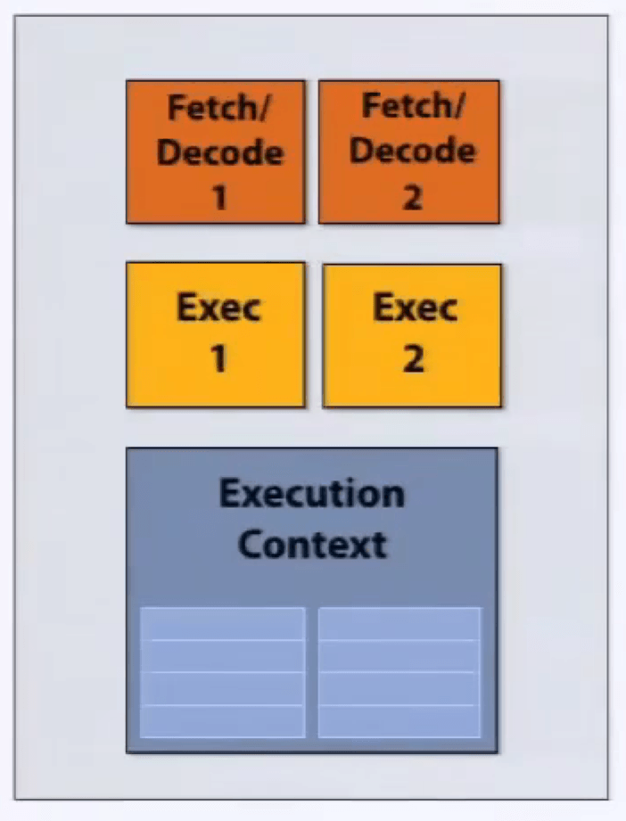
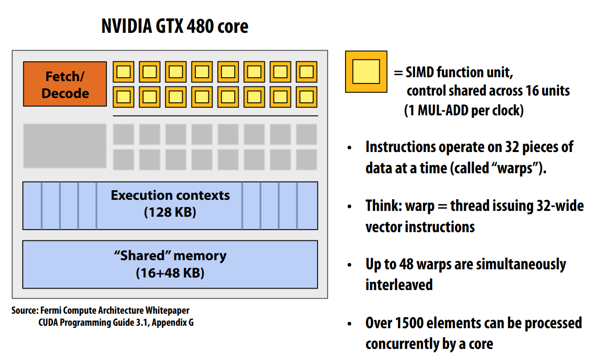
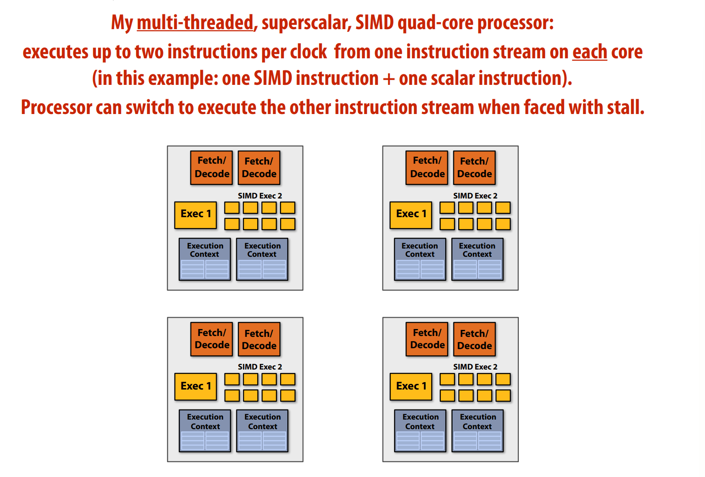
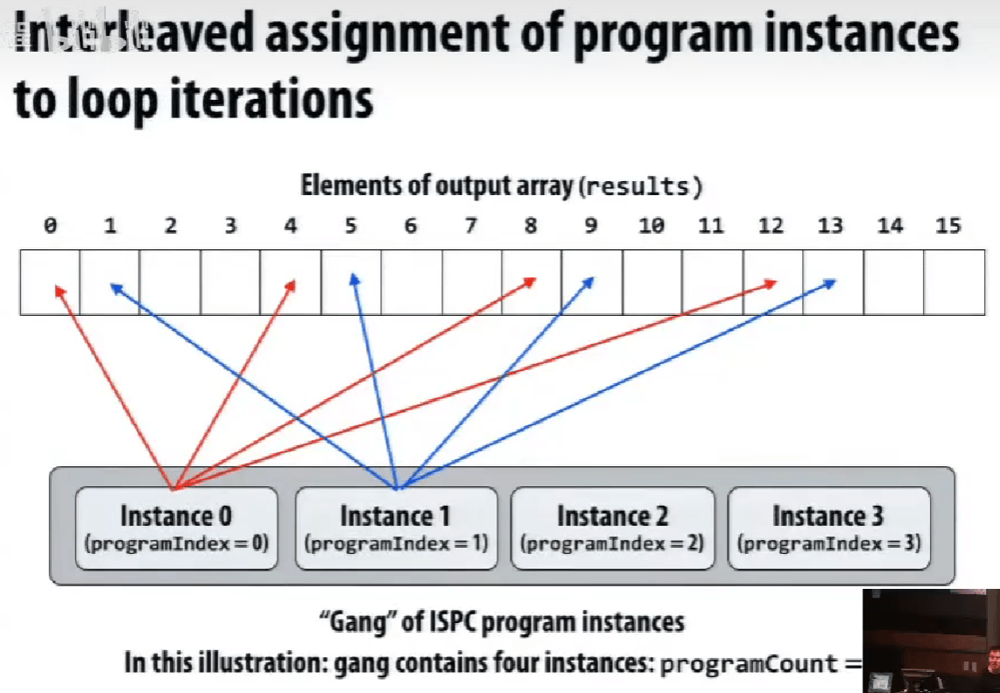
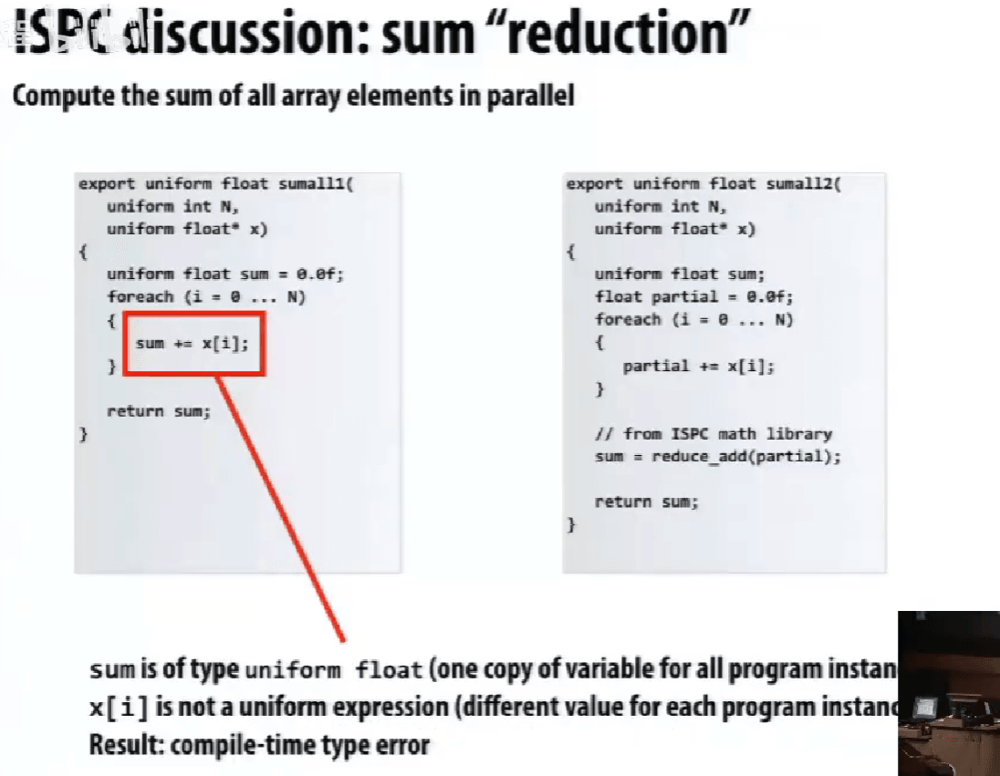
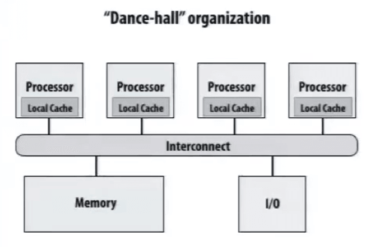
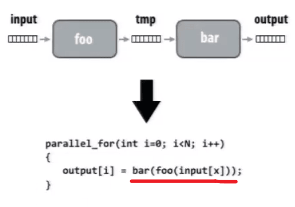
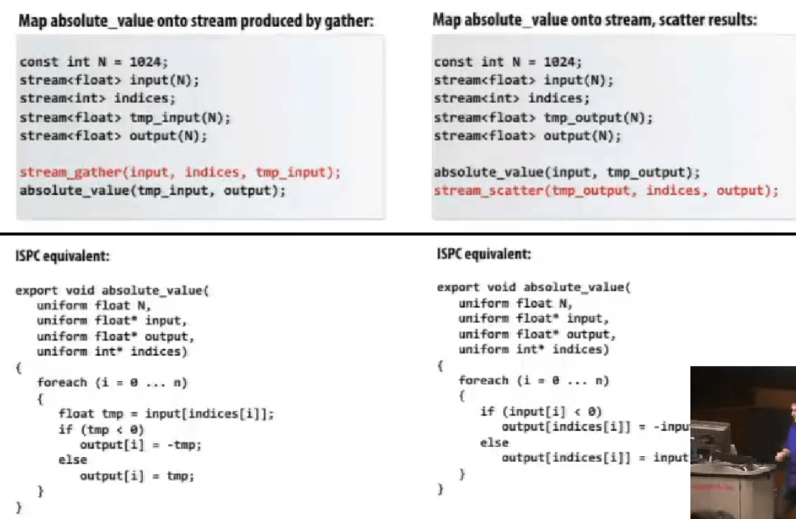

# CMU 15-418/15-618 X Stanford CS149: Parallel Computer Architecture and Programming

> 封面来源：[@toutenkou10105](https://x.com/toutenkou10105/status/1959553399827161120)

> 15-418 Watch lecture video of 2016 spring and do assignments of 2018.
>
> CS149 Watch lecture video of 2023 spring and do assignments of 2024.

> [!TIP]
>
> 做 PA3 的时候，发现还是对照着做好一些，转向看 CS149 的 slides。
> 事实证明，有对应的，先看对应的；有新的，看新的。

## Why Parallelism? Why Efficiency?

**通信开销**不能忽视，导致不能达到理想的加速比。

**负载不平衡**，负载少的等待负载多的。

**Themes**：

- 设计、编写并行算法，并行思维，
- 了解底层硬件特性
- efficiency 高效 ≠ 快，不同的应用场景看法不一样。

### Insttuction Level Parallelism (ILP) 指令级并行

单核处理，需要按照程序计数器 PC 串行运行，而实际上，不是所有指令都有严格前后依赖关系，可以同时运行。

通常的程序，ILP不会超过4,同时，虽然晶体管数量能以摩尔定律增长（之前），时钟频率瓶颈，当晶体管中都有不小的电容，此时要提高频率就需要增大电压，高电压，高发热，高能耗，就提不上去了。

**Power wall**

$\text{Dynamic power} \propto \text{capacitive} \cross \text{voltage}^2 \cross \text{frequency} $

**单指令流**到达性能提升瓶颈，发热、能耗，ILP通常不能超过 4 倍；

**调度**、**通信开销**、**负载均衡**，使得不能达到最高的加速比

## A Model Multi-Core Processor

### Part 1: parallel execution

处理器，抽象组件：取指令、译码，执行指令，执行上下文。


**superscaler execution** 超标量执行，在指令流中，两条指令是独立的，处理器发现并并行处理。

并不是真正意义上的并行，可能采用 pipeline 流水线技术。



快速单指令流的技术：**内存预取**、**分支预测**、**乱序执行** Out-of-Order Execution, OoOE。

**乱序执行**，Instruction Window **指令窗口**，译码后先放入指令窗口，指令准备所需数据就绪就执行；有序提交，Re-order Buffer **重排序缓冲区**缓存乱序执行的结果，确保正确顺序更新。

这些技术虽然能加速，但也占据了处理器的很大**空间**，需要不少成本。


**多核处理器**如果遇到**单指令流程序**，不能加速。


标量程序与向量处理器，并不能加速，需要对应，SSE、AVX 指令，是 SIMD 指令。


**多核**和**SIMD**是正交的，可以结合。

多核、多线程、多核执行与SIMD执行，有区别，SIMD 需要**共享指令流**。

现代的非朴素的编译器，只有在判断条件符合的时候，才会尝试给执行里面的内容。

**术语** Terminology

- Instruction stream coherence **指令流一致性**

  一些列不同的逻辑序列能共享相同的指令流，有指令流一致性，在 SIMD 架构下运行的很好。
- Divergent execution **发散执行**

  缺乏一致性。
- cache coherence **缓存一致性**

SIMD on CPUs，显式的。


SIMD on GPUs，隐式的，更高层级的抽象。


描述机器，X **cores**, Y SIMD ALUs per core (**SIMD width**)

$\text{FLOPS} = \text{Frenquency(Hz)} \cross \text{Cores} \cross \text{SIMD width} \cross \text{MAD}$

A核B宽SIMD 与 B核A宽SIMD：指令流在 8 条一组下的一致性，可能不如 4 条一组。

**总结**

若干并行运算的方式：

- **Multi-core**，多核，多处理核

  thread-level 线程级并行（不同指令流在不同核上）

  软件决定什么时候创建线程 e.g. pthreads
- **SIMD**，多ALUs，被同一条指令流控制（within a core）

  为 data-parallel 数据集并行设计，控制的开销被 ALUs 均摊

  向量化被编译器（显式SIMD）、runtime 运行时完成。

  需要被说明，或者需要被高级编译器的循环分析
- **Superscalar**，超标量，利用一条指令流的 ILP 指令级并行(within a core)

  硬件自动、动态的并行化。

  超标量架构的CPU核心本身在一个时钟周期内就能执行多条指令。

（增加资源来提高峰值计算）

### Part 2: accessing memory

**术语**，Terminology

- **Memory latency**，内存延迟

  内存请求的总时间，存/取。

  **latency** 延迟是衡量某时间所需时间长短的指标。

  e.g. 更快的车、更高的限速标准。
- **Memory bandwidth**，内存带宽

  **bandwidth** 带宽是单位时间内发生多少事情的指标。

  e.g. 增加车道。

（两者的相关性取决于重叠处理程度）

**stalls**，在有依赖先前的指令的时候，处理器需要停顿。

比如，内存读流水线并行，可以提高带宽，但因为对比很长的读取周期，延迟可能没有太多变化。

**cache**，把**降低内存加载的延迟**，length of stalls（reduce latency）

**prefetch**，减少 stalls（**hides** latency）

用 **multi-threading** 多线程来隐藏 **stalls** 停顿，切换线程；各自的寄存器组，对应各自的执行上下文，即可以在**同一处理器**下运行**多条指令流**。

缓解等待耗时长的操作（e.g. 内存访问），处理器的空闲时间变少了，处理器性能发挥得更加充分。

和 OS 的切换概念是相同的，机制是不同的，如果让 OS 来管理这个切换，开销大。


问题：上下文存储空间是有限的，Trade off。

更多但更小的上下文（更强的**延迟隐藏**能力）

更少但更大的上下文（更大的 L1 cache）

没有增加计算资源，提高了高效利用资源的能力。

这种模式有多个不同的版本：

- **Interleaved multi-threading** (a.k.a. tmporal multi-threading) 交叉多线程 / 时间多线程

  前面提到的技术
- **Simultaneous multi-threading** (SMT) 同时多线程 / 同步多线程

  每个时钟周期，核心从多个线程中选择指令去在 ALU 上运行

  superscalar 的设计的扩展

  e.g. Intel Hyper-threading (2 threads per core)

**多线程**的代价，假定 cache 没用，不是**降低延迟**，是通过做别的事情来**隐藏延迟**。

这也是 GPU 每个核心有很强的计算能力、很多线程，但是只有不大的缓存。

CPU 的每个核心有两个线程。

CPU 的设计是为了降低延迟；GPU 的设计是精细设计、减小 cache 体积，使得能集成大量的 ALU 来计算。



一个 Warp 的完整上下文，实际上是：

1 个程序计数器 (PC) 和 32 组通用目的寄存器 (General-Purpose Registers, GPRs)，每个线程独享一组。

48 个交叉 warp 是 48 个执行上下文。


ALU 运行在两倍于芯片其他部分的时钟频率，所以，相当于是 32。

这个是 **hot clocking** (**shader clock**)，但因为能耗太高，下一代架构就砍掉了（x

**思维实验**


是不是一个好的并行程序。

pros: 可 SIMD，可利用多核，不可以隐藏延迟（？）

cons: 所需的内存带宽太大了，每个计算所产生的内存访问需要大大超出了现在的计算机设计。

实际上，由于内存带宽限制，在 CPU 与 GPU 上跑得差不多。

一个周期的 MADs $Core \cross SIMD \ function\ units = 15 \cross 32 = 480 $



一些**术语**：

- Multi-core processor
- SIMD execution
- Coherent control flow
- Hardware multi-threading
  - Interleaved multi-threading
  - Simultaneous multi-threading
- Memory latency
- Memory bandwidth
- Bandwideth bound application
- Arithmetic intensity

（高效利用资源）

## Parallel Programming Abstractions

Abstraction vs. implementation

### task abstraction


Hyper-threading，超标量 + 多线程。

ISPC **gang abstraction** by SIMD on one core, programming instances

不同的映射方式 map，抽象的理解方式和实际的执行方式的不同。

实际不同实例是一起执行的，所以第一种才是连续的内存访问。

1. 

   
2. 

   

ISPC 只涉及到 SIMD 的实现，不涉及到多核处理。

在单个执行线程内，利用单个执行上下文，通过 SIMD 指令完成操作。

不能在 ISPC 函数中调用 ISPC 函数。

ISPC 归约求和，`reduce_add()`，



spawn **gang**, **tasks**。

向上、向下表达的层是什么？


### Three models of communication (abstractions) 通信模型抽象

**Shared address space**

共享地址空间通信模型，抽象化共享内存地址空间。

线程之间通过**读/写**共享变量来通信。

同步原语 e.g. locks，也是通过共享变量实现的。



如果想要放很多的核心，很容易产生瓶颈，所以出现设置**分区**，Non-uniform memory access (NUMA)，比如 cache。

**Message passing**

消息传递模型，线程操作自己的私有地址空间，通过显式的**收/发**信息来通信。

**Data-parallel**

对数组中的元素执行同样的操作，如 SPMD 编程（ISPC），集合中的**元素是独立**的。

**stream programming** 流式编程



**优点**：如上图，从 read - operate 1 - write - read - operate 2 - write 变成 read - operate 1 & 2 - write，减少了内存带宽的压力。

（给定相关信息，编译器能够优化）

**缺点**：需要引入新的操作符。

数据流操作：分散**scatter**和聚集**gather**。



cache 命中问题？所以，这样的指令是 costly 的。

**一段代码意味着什么，程序语义是什么，怎么实现的。**

## Parallel Programming Basics

创建并行程序：分解Decomposition, 分配Assignment, 编排Orchestration, 映射Mapping。


### 分解 Decomposition

分解**不一定是静态**的，创建至少**足够的任务**去让执行单元繁忙。

关键，独立**identifying dependencies**。

阿姆达尔定律 **Amdahl's law**：

需要顺序执行的部分，s，$\text{speedup} \le \frac{1}{s + \frac{1-s}{p}}$。

程序员需要声明哪些部分是**独立**的。

### 分配 Assignment

在 ISPC 的例子中，使用 `foreach`比手写 `programIndex`与 `programCount`要更有可移植性，因为**更高层级的抽象**可以让编译器根据硬件去选择优化。

系统上创建线程的开销，不可忽视，特别是创建的线程数很多的时候。

一般创建线程数就是**执行上下文**的总数，然后作为 worker pool，用 next_task 等。

### 编排 Orchestration

略，后续课程具体讲。

包括结构化通信、同步、组织数据结构、安排任务。

减小通信/同步开销，保持局部性等。

### 映射 Mapping

映射"threads"("workers")到硬件执行单元。

1. 系统 OS，e.g. pthread to HW execution context
2. 编译器 compiler，e.g. ISPC program instances to vector instruction lanes
3. 硬件 hardware，e.g. CUDA thread block to GPU cores


用 Gauss-Seidel 解决偏微分方程 PDE。

从左上至右下，每个元素取十字相邻的五个元素（包括自己）的均值。（是直接利用最新版本的数据更新的）


如果强行要求并行版本的结果与串行执行版本一致，我们找到的独立/并行的元素是**对角线**，**多轮迭代**同时进行，仍然效果没有那么好。

改变算法执行顺序，更加适合并行化（尽管会带来少许结果的不同）。


打破原本的依赖关系。


交替执行红黑块。

wait <=> **barrier**，`barrier(myBarrier, NUM_PROCESSORS)`都需要到，才会继续运行，尽可能减少 barriers。

因为不少应用的的解法来自统计计算，所以可以去为了提高并行度，而降低些准确性。


需要通信的情况。


编排 Orchestration 使用花括号、系统函数。

## Part 1: Work Distribution and Scheduling

核心目标（其中有冲突）：

- 均衡负载
- 减少通信（stalls）
- 减少额外工作（overhead）

建议一、**总是先实现最简单的解决方法，再测试性能，判断是否需要做得更好。**

### Balancing the workload

**static assignment**

静态分配，简单、不会有额外运行时的开销。

当工作的花销和任务的数量是可预测的时候，可以去提前想出好的分配方案。

就算每一份工作不是平衡的，只要是可预测的，也可以提前调度。

**"semi-static" assignment**

较近的未来是可预测的，如自适应网络。

分配方案在重新调整的时候是静态的。

（重建分配是静态的）

**dynamic assignment**

在运行时确定，lock。

控制同步的开销，**增大任务粒度**（一次通信做更多的事情）

**均衡任务大小**（均衡负载和最小化分配开销之前）

**优化任务调度**（把大任务也切成小任务来调度、可能增加同步开销，关注量而非数量调度、先分配大任务）

**分布式队列降低同步开销**（从别的任务队列中「偷」任务）

有依赖的任务队列？

### Schedule fork-join parallelism

大任务分解成若干个小任务并行执行，然后将这些小任务的结果合并，分治。

```c++
// Clik Plus（C++ 扩展，MIT，公开标准）
// 函数并行的抽象
clik_spawn foo(args);
clik_spawn bar();
clik_spawn fizz();
buzz();
clik_sync;
```

抽象层面想好了，具体实现的话，如果为每一个 cilk_spawn 创建一个线程， cilk_sync 使用堵塞，显然会有很重的线程创建开销。

具体地，我们可以使用**线程池**的方式实现。

**Child Stealing vs Continuation Stealing**

**续体优先（Run continuation first, child stealing）**：

- BFS
- 这种策略是让父线程继续执行 `cilk_spawn` 之后的代码（在此例中为 `bar();`），而将 `foo()` 排入可执行任务队列，以供当前线程或其他线程稍后执行。
- **优点**：父线程继续执行可能减少上下文切换的开销，并利用现有的局部性。
- **缺点**：如果 `foo()` 很重要或者非常耗时，推迟其执行可能会影响程序的整体性能。

**子任务优先（Run child first, continuation stealing）**：

- DFS
- 这种策略是立即执行 `foo()`，而将续体（`bar();`）加入任务队列，以供其他线程"窃取"（stealing）执行。
- **优点**：这可以快速启动可能的重要或复杂的并行任务，尽快获得其计算结果。
- **缺点**：可能导致父线程的局部数据和状态被挂起，增加了线程间切换的可能性。

**steal 从工作队列的队头还是队尾 steal？**

- 设计 deque 双端队列。
- 当前 thread 从 botttom push/pop，其他 thread 从 top 进行 steal，避免锁同步。

只要空闲，还有任务可以偷，就偷。

堵塞之后的任务不一定还在主线程上运行。

## Part II: Locality, Communication, and Contention

### shared address space model

抽象的具体实现。

**共享地址空间硬件结构**


### Message passing

`send()`, `recv()`。

**Arithmetic intensity** 计算强度

$\text{Arithmetic intensity} = \frac{\text{amount of computation (e.g., instructions)}}{\text{amount of communication (e.g., bytes)}}$，越高越好。

如果分子是**计算的执行时间**，这个比率给出了代码**平均所需的带宽**。

$\frac{1}{\text{"Arithmetic intensity"}} = \text{communication-to-computation rate}$

**通信的两个原因**：

- inherent communication，算法成立的固有的通信

  分配得更加合理，可以减少固有通信。

  

  
- 人为造成的（系统的具体实现导致的）

  如和 cache 的表现相关、系统的数据转移的最小粒度、实际上只要写入，但是 cache 还是会读入 cache line。

### Techniques for reducing the costs of communication

**提升空间局部性**

- 改变网格遍历顺序

  「块状 blocked」遍历顺序 cache
- 「融合 fusing」循环

  提升计算强度 arithmetic intensity

  load / store per arithmetic

  （存在功能模块化、代码可读性等的取舍）


**Contention 竞争**

使用树状结构来减少竞争。


**总结**

- 减少通信开销

  发更少、更大的消息（均摊开销），具体地，合并小消息成大消息
- 降低通信延迟

  重构代码来利用局部性，硬件上提升通信架构
- 降低竞争

  复制被竞争的资源（本地副本、细粒度锁），错开访问
- 提升通信/计算重叠

  异步通信，硬件上流水线、多线程、预抓取、乱序执行，并发性大于执行单元数量

**总是从最简单的并行实现开始，再去测量你所达到的性能。**

**性能分析策略**

确认你的性能是被**计算、内存带宽、内存延迟、同步**限制了？

"high watermarks"：实际上你最好能做到多少，距离最好的情况差多少？

**Roofline model**

屋顶线模型 - X-axis 计算强度、Y-axis 最大可获得的指令吞吐量


**建立 high watermarks**

- 增加不涉及内存的命令

  如果执行时间线性增长，代码瓶颈是指令速率。
- 去除大部分计算，读取相同的数据

  执行时间如果没有降低多少，则可能是内存瓶颈。
- 把所有的数组访问变成 A[0]

  变快很多的话，考虑提高数据访问局部性。
- 去除所有原子操作 / 锁

  如果快了很多（保持相同的工作量），瓶颈在同步开销。

**使用 profilers / performance monitoring 工具**

如  instructions completed, clock ticks, L2/L3 cache hits/misses, bytes read from memory controller, etc.

```cpp
// Intel's Performance Counter Monitor Tool, C++ API
PCM *m = PCM::getInstance();
SystemCounterState begin = getSystemCounterState();
// code to analyze goes here
SystemCounterState end = getSystemCounterState();
printf(“Instructions per clock: %f\n”, getIPC(begin, end));
printf(“L3 cache hit ratio: %f\n”, getL3CacheHitRatio(begin, end));
printf(“Bytes read: %d\n”, getBytesReadFromMC(begin, end));
```

**理解任务规模问题**

绝对表现（时间、每秒操作数），加速比、高效（每面积、钱、瓦）

**陷阱：固定任务规模的加速比**

不同规模，相同算法的表现不同。

（如前面的 2D 分配方式，在 N 小 P 大的时候，反而可能不如原本最差的版本）


超线性的加速比（对 cache 合适的配置）


- 所以，不同任务规模、不同并行规模在不同任务上有很大的不同。

  load balance, overhead, arithmetic intensity, locality of data access
- 只用固定的任务大小来测试一台机器的方法是很有问题的。

  过小的任务，并行开销大于并行好处；

  未能充分利用大机器的优势。

### General program optimization tips

- Measure, measure, measure... 测量评估
- Establish high watermarks 找到瓶颈
- 意识到规模问题，任务是不是很好的匹配机器了？

## GPU Architecture and CUDA Programming

### Graphics 101 + GPU history (for fun)

为了更好的渲染图形。

图形学的关键要素：**顶点**，**基础图形**（如线、三角形），**片段**，**像素**。


1. 输入一系列**三维顶点**；
2. 计算在**二维屏幕**的位置；
3. 生成**基础图形**集合；
4. 分割成片段，变成新的**二维顶点集合；**
5. 计算**颜色**。


**OpenGL API**，调整材质的光泽等等。

**graphics shading language**


（粗糙的hack使用）

**GPU-based 的科学计算**

由于 CPU 的速度发展相对缓慢，开始把图形处理器用于科学计算。

**GPGPU 通用图形处理器** 2002-2003

（编译器）

**Brook stream 编程语言** 2004

编译成 OpenGL 命令。

**GPU ccompute mode**

不需要看作图形操作流水线的设备，而是作为大型数据并行的处理器。

在 2007 年之前，只能进行特殊的 ISA 操作。

**NVIDIA Tesla with CUDA** 架构 2007

硬件上实现了数据并行

由最初开发 Brook 编译器的 PhD 移植到了 GPU 上。

"C-like" 语言，相对底层。

OpenCL 是 CUDA 的开放标准版本。

CUDA 只能在 NVIDIA GPU 上，OpenCL 可以在 CPU / GPU。

### CUDA program

特别的 Thread 含义在 CUDA 编程语言的体系中，就如同 Program Instance 在 ISPC 的体系中的特殊语义，不等同 pThread 在 CPU 上。

层次化的并发线程集合模型。

二、三维，有出于一维确定各个维度，除法的开销大的考虑。


线程的调度在硬件集成。

warp，线程束（CPU 类比 32-SIMD，GPU 32 独立执行上下文共享一条指令）

如果要求的线程数，超过了总可能的块内的线程数，无法编译，因为 `__syncthreads()`会形成死锁，等待。

创建直方图，不同块要访问同一个内存地址。


哪个是有效的代码。


## Data-Parallel Thinking

对序列数据的操作。

### Map 映射

逐一对 $seq_a$ 每一位应用 $func()$ 输出到等长的 $seq_b$。


**Parallelizing map**

以任意顺序应用，相互之间没有依赖。

### Fold 归约（fold left，从左到右）

将二元操作依次应用。


**Parallel fold**

无关运算合并先后的。


### Scan 扫描

**scan inclusive**

做前缀（二元操作），包含自己。


**scan exclusive**

做前缀（二元操作），不包含自己。

**Parallel Scan**

无关运算合并先后的。


伪代码：


多个小块内部处理，再根据块 base 重建。

**Parallel Segmented Scan**

操作**序列的序列**。

[seq1, seq2, seq3]

同时传入长短不定的序列，都需要操作，比如 `scan_exclusive`。

如果不统一调度处理，很容易出现负载不均衡的情况。

增加开始标志 "start-flag"。

示意图：


伪代码：


应用场景：

**稀疏矩阵乘法**


### Gather / scatter 聚集 / 分发

- **gather(index, input, output)**

    output[i] = input[index[i]]

- **scatter(index, input, output)**

  output[index[i]] = input[i]


**在某些条件下，可以把 Scatter 转化为 Gather**

假设索引中的元素是唯一的，并且索引中的所有元素都被引用（scatter = sort + gather）。

如果上面的条件不满足的时候（scatter = sort + map + gather）。

这种多个的组合在 `find_repeats` 中也能见到。

**更多序列操作**

- **Group by key**
- **Filter**
- **Sort**


应用场景：

- N 体问题
- 并行直方图

CUDA 中的一个高效并行算法库：**Thrust**

## Distributed Data-Parallel Computing Using Spark

集群 Cluster 上的数据并行。

- Scalable，可规模化
- Fault-tolerant，容错
- Efficient，高效

$\text{System MTTF (Mean Time to Failure)} = \frac{1}{\sum_{i=1}^{n}{\frac{1}{\text{MTTF}_i}}}$

**Storage System 存储系统**

如果节点 node 出现故障，如何持久地存储数据？

### Distributed File System 分布式文件系统

提供全局文件命名空间 Global file namespace，如 Google GFS, Hadoop HDFS。

**典型使用模式**

- 超大文件
- 数据很少就地更新
- 读取 read 和 附加 append 是最常见的，如 log 日志。

**Distributed File System (GFS)**

- **块服务器 chunk server**

  - **HDFS** 中的 **DataNodes**
  - 文件被切分成连续块（常常 64 - 256 MB）
  - 每个块都有副本（常常 2 - 3 份）
  - 尽量把不同副本放入不同机架
- 主节点 **master node**

  - **HDFS** 中的 **NameNode**
  - 存储元数据；常常被复制副本
- 客户端的文件访问库

  - 让主节点找到块（数据）服务器
  - 和块服务器直连获取数据

**Hadoop Distributed File System (HDFS)**


**Message Passing Interface (MPI)**，实现 Message Passing 模型的接口。

### MapReduce

map + reduce (fold) => MapReduce

**作业调度的合理性**

- 利用数据局部性，"move coputation to the data"

  mapper 作业在包含输入块的节点上运行

  reducer 作业在已经有某字段最多数据的节点上运行
- 解决节点故障

  调度器检测作业故障并在新机器上重新运行作业。

  因为输入是持久存储的。（分布式文件系统）

  调度器在多个机器上复制任务。（降低处理故障产生的开销）
- 解决慢机器

  调度器复制作业到多台机器上。

**MapReduce 好处**

提供了数据并行的模型，简化了集群编程。

- 将作业自动划分为 map 和 reduce 任务
- 局部感知调度
- 负载均衡
- 故障恢复、慢机器适应

**问题**

- 只支持简单的 map, reduce 编程结构
- 迭代算法每一次都要从硬盘中读数据

用户需要更复杂、多阶段的应用。

### Apache Spark

**in-memory, fault-tolerant distributed computing**

重用中间数据集的集群规模计算的编程模型。

不把中间数据写回持久分布式文件系统（不高效）

**in-memory calculation，容错怎么保证？**

- 复制所有计算

  成本高，降低峰值吞吐
- 检查点 Checkpoint 和回滚 rollback

  定期存储到持久分布式文件系统

  故障后从上一个检查点开始
- 维护日志 log 更新

**MapReduce**

- 在每步 map, reduce 后，都会建立 checkpoint
- 函数式结构允许只重启一个 map, reduce 任务，不需要整个程序重启

**Resilient Distributed Dataset (RDD) 弹性分布式数据集**

Spark 的重要编程抽象

- 只读记录有序集合（不可变）
- RDDs 只能在对持久存储 / 现存 RDDs 进行确定的**转换** transformation 时被创建
- RDDs 的 Action 操作把数据返回给应用

一次性全读进来，并且在内存中存着，经过几个操作会比在硬盘中占的空间还大。

所以，考虑 loop fusion 和 "streaming"，流式处理，一次处理完一行数据。

能不能进行 fusing，需要看 Narrow dependencies / Wide dependencies （如 groupByKey），即是否不需要和别的节点通信。

使用 `PartitionBy` 可以控制划分的方法，在一些操作的使用上达到 Narrow dependencies 的效果。

通过血缘谱系 Lineage 来实现弹性 Resilience，运行时系统可以通过 Lineage 重建 RDD 的内容。

Lineage 是 Transformation 的 log，粗粒度，存储高效。

`_.persist(RELIABLE)` 允许让在长 Lineage 中，设置 checkpoint。

规模化不是终点，COST = “Configuration that Outperforms a Single Thread”。

不仅追求规模化，更要有比单线程更好的效果，即也追求高性能。

## Efficiently Evaluating DNNs (Software Solutions)

没太多新东西，特别是先做 PA 回头来看的话。

提到的一些优化方式，神经网络结构优化、算子优化（分块、融合）、压缩模型（低精度、稀疏化、剪枝）。

GPU 为什么是 DNN 的好平台？高计算强度、算力高、高性能库多。

GPU 为什么可能是次优的 DNN 平台？通用部分可能没那么需要。

## Hardware Specialization

功耗限制型计算

专用硬件，追求更好的能耗比。

ASIC (Application-Specific Integrated Circuit)

FPGAs (Field Programmable Gate Arrays), Verilog

DSP (Digital Signal Processor)

介绍了一些专用硬件。

降低功耗：专用的处理单元、减少数据移动。

适当考虑重算，多考虑整数运算。

DRAM 的工作逻辑

[ Precharge (PRE, 用于传输的 bit line) + row activate (RAS, 待读取行) ] + column access (CAS)

data pins 利用率低，一个 DRAM 多个 bank 共享一个 data pins 流水线。

DIMM (Dual Inline Memory Module)

Dual-channel memory system 双通道内存

Simpler setup: use single controller to drive same command to multiple channels


DDR (double data rate)

HBM (High-bandwidth memory)，高带宽，高能效，小体积。

内存瓶颈的解决方式：

应用工程师：编程局部性

硬件架构：DRAM 调度、距离更近、计算移到内存中、数据压缩。

## Programming Specialized Hardware

TPU - Systolic array 脉动阵列，很有节奏感了。


TMA (Tensor Memory Accelerator)

ThunderKittens, A Simple Embedded DSL for AI kernels

设计原则

- 16x16 Tile layouts
- 异步
- GPU 协调模式，生产者 - 消费者

MetaPipeline = Streaming Dataflow


PCU: Pattern Compute Unit

PMU: Pattern Memory Unit

AGCU: Address Generator and Coalescing Unit

## Programming Specialized Hardware II + Cache Coherence

cache line


**Write-Through**（写通）：

当应用程序执行写操作时，数据会同时写入缓存和主存储器。

数据一致性，但要写两次。

**Write-Back**（回写）：

写操作仅更新缓存，并标记为“脏数据”。只有当缓存中的脏数据块即将被另一个缓存块替换时，才会被一次性写入主存储器。

数据不一致，数据丢失风险。

**write-allocate**，会先将数据块从主内存读取到缓存中再写入；

**write-no-allocate**，则直接将写入操作执行到主内存，不将数据加载到缓存。

缓存未命中 cache miss 的 3 C：cold, capacity, conflict。

缓存一致性 cache coherence，缓存 cache 和内存 main memory 之间的不同。

单写者-多读者不变量 Single-Writer, Multiple-Reader (SWMR) Invariant

shared cache，简单，但是在 cache 上竞争 contention

write-through 方法，简单，但是其他 local cache 都失效了

write-back 方法，当写入 cache 后缓存只是合法副本的缓存，变成独自 exclusive 的所有权，当别的处理器要读取这个数据时，它要送过去。

“modified” 状态，不需要通知别人，因为它肯定是不合法的。

由 cache controller 来控制。

**MSI write-back invalidation protocol**

三种状态：

Modified (M): line valid in exactly one cache (a.k.a. “dirty” or “exclusive” state)

Shared (S): line valid in one or more caches, memory is up to date

Invalid (I): same as meaning of invalid in uniprocessor cache

PrRd (read)

PrWr (write)

BusRd: obtain copy of line with no intent to modify

BusRdX: obtain copy of line with intent to modify

BusWB: write dirty line out to memory


**Obtain exclusive ownership before writing**

BusRdX causes others to invalidate

If M in another cache, will cause writeback

BusRdX even if hit in S - promote to M (upgrade)

只能在 M 状态写入，需要告诉 cache controller，现在独占读入权，要写入，其他不能读。

**MESI invalidation protocol**

对于常见的读后写，需要两个转换，I ==BusRd=> S ==BusRdX=> M，在不共享的时候也存在。

增加 E (exclusive clean) ，独占权 exclusivity 和所有权 ownership 分离。（合法的副本）


广播 broadcast，不可规模化；

目录 directory，可规模化。

只是发送一致性信息。

$\text{Average Memory Access Time (AMAT) }= \sum_0^n{\text{frequency of access} \cross \text{latency of access}}$

多处理器的 MAT 会增加。


工具：**VTune**

预期外的通信：伪共享 false sharing

cache 是以 cache line 为单位的。

所以，代码一，实际不同线程之间会反复「竞争」一个线程；

代码二，对 cache line 进行补全，不会「竞争」。


缓存一致性的问题出现的原因是，单位共享地址的抽象与单个存储单位的实现不一致。

基于侦听 snooping-based 的缓存一致性方法，每当有可能影响 cache coherence 的操作，就会广播。

HW，减少 coherence 的开销；SW，警惕人工引入的由一致性协议 coherence protocol 引起的通信。

规模化 scalable 的 cache conherence，使用基于目录 cache coherence 的方法。

## Cache Coherence

**Memory Consistency**

缓存一致性和内存连贯性。

cache coherence 是多副本的一致性；memory consistency 是多个内存操作执行顺序的连贯性（一致性）。

synchronization library / kernel /  lock-free ds

***Memory coherence** defines requirements for the observed behavior of reads and writes to the **same** memory location.*

***Memory consistency** defines the behavior of reads and writes to **different** locations (as observed by other processors).*


Sequential Consistency

顺序保障，但是为了提高性能，选择重排。

**write buffer**，放松了 W-R 先写后读。

TSO (Total Store Order)

PSO (Partial Store Ordering)，加锁类似。

**these are all valid optimizations if a program consists of a single instruction stream**

Weak ordering (WO)

Release Consistency (RC)

同步 synchronization 来挽救。

Fence (memory barrier), read-modify-write/compare-and-swap, transactional memory, …

**Intel x86/x64 ~ total store ordering**

提供特定的指令去说明，指令不需要保证顺序。

mm_lfence (“load fence”: wait for all loads to complete)

mm_sfence (“store fence”: wait for all stores to complete)

mm_mfence (“mem fence”: wait for all me operations to complete)

**ARM processors: very relaxed consistency model**

data race free (DRF)

## Lock Implementations, Fine-Grained Synchronization and Lock-Free Programming

死锁 Deadlock，正确性，有未完成的任务需要完成， 但是没有操作可以进行。

活锁 Livelock，正确性，一直在做无意义的操作， abort and retry。

饥饿 Starvation，公平性，一个任务处理，其他任务没有操作。

```bash
# Test-and-set based lock (Atomic)
ts R0, mem[addr] 

load mem[addr] into R0
if mem[addr] is 0, set mem[addr] to 1

# x86 cmpxchg
# Compare and exchange (atomic when used with lock prefix)
lock cmpxchg dst, src

if (dst == EAX)
  ZF = 1
  dst = src
else
  ZF = 0
  EAX = dst
```

线程越多，lock 的 contention 越激烈，时间越长。

**Test-and-test-and-set**，在 lock free 之前，while 等待；公平性没有保证。

less traffic <=> more scalable

**ticket lock**，等待 lock free，取票，等 unlock 叫号。

compare and swap

fetch-and-op

Lock-free queue (bound / unbound)

Lock-free stack

CAS (compare_and_swap)

double compare and swap

**“读取-尝试-重试”的循环是无锁编程的标志性模式。**

while + CAS

无锁是用如原子操作的底层方式来保证线程安全。

## Relaxed Consistency + Domain-Specific Programming Systems

### relaxed memory consistency

见 Cache Coherence。

### DSL (Domain-Specific programming languages)

**Halide**, for image processing.

不是为新手准备的，提供了一系列的用于优化的原语。

系统搭建的关键，为作业选择合适的再现方式。

**Choosing the “right” representations for the job**

自然、可靠、性能；调度（呈现成骨架、草图、pipeline 的感觉）

**Lizst**, PDE’s on meshes.

编译器决定用什么数据结构。

可迁移，CPU, GPU 采用不同的算法。

把握最重要的元素、简单的系统、原语组合。

## Transactional Memory

事务内存，另一种同步抽象，声明式 declarative，如 `atomic{}`。

命令式 Imperative

atomic { } ≠ lock() + unlock()

数据版本控制策略 data versioning policy

- Eager versioning (**undo-log based**)
- Lazy versioning (**write-buffer based**)

**Pessimistic Conflict Detection** (悲观冲突检测)

"Eager" (主动的)

**Optimistic Conflict Detection** (乐观冲突检测)

"Lazy" (懒惰的) 或 "Commit" (提交时)

STM (Software Transactional Memory)

## Transactions II + Ask Me Anything with Kayvon and Kunle

**Hardware transactional memory** (HTM)

Data versioning is implemented in caches

Conflict detection through cache coherence protocol