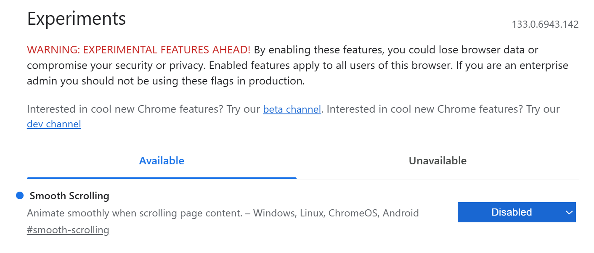

# 喜闻乐见的软硬件问题大赏


## Chrome 谷歌浏览器，在 Bilibili 视频页面，鼠标滚轮滚动延迟、果冻效应等

关闭谷歌浏览器「平滑滚动」。

1.   打开 Chrome 谷歌浏览器，在地址栏中执行如下指令： **Chrome://flags/#enable-smooth-scrolling**
2.   找到「**平滑滚动**」选项，**smooth-scrolling** 选项，选择「关闭」，**Disabled**。



## 鼠标滚轮停顿、延迟、回滚、乱跳等

[知乎比较全面的回答](https://www.zhihu.com/question/41680058/answer/2720712055)

滚轮编码器脏了，使用WD-40，或者换个新的滚轮编码器。

拆开鼠标，往滚轮和编码器处喷些 WD-40 即可，注意量不用太多。

## Windows 系统对文件路径的最长长度限制导致的问题

如安装 Python 的 vLLM 库时，遇到 `error: could not create 'build\bdist.win-amd64\wheel\.\vllm\model_executor\layers\quantization\utils\configs\N=1536,K=1536,device_name=AMD_Instinct_MI300X,dtype=fp8_w8a8,block_shape=[128,128].json': No such file or directory`错误。

这实际是由安装过程中需要创建的某个文件的完整路径超过**长度限制**导致的。

虽然安装 Python 时好像是会提示**是否禁用文件名长度限制**，但是在 conda 环境安装 Python 时是没有的。

这里只介绍一种方法，修改注册表。
1. 打开注册表编辑器
    - 按下 Win + R 键打开“运行”对话框。
    - 输入 regedit 然后按回车键。
2. 导航到指定路径
    - 在注册表编辑器的地址栏中，复制并粘贴以下路径，然后按回车键：`HKEY_LOCAL_MACHINE\SYSTEM\CurrentControlSet\Control\FileSystem`。
3. 修改键值
    - 在右侧的窗口中，找到一个名为 LongPathsEnabled 的值。
    - 如果找不到，可以右键点击空白处，选择 “新建” -> “DWORD (32 位) 值”，并将其命名为 LongPathsEnabled。
    - 双击 LongPathsEnabled，将它的“数值数据”从 0 修改为 1。
4. 重启电脑
    - 确保设置生效。

## Windows 系统 C 盘拯救计划（文件软链接搬迁）

笔者苦 C 盘「红温」久矣，故找寻到此方法，因为软链接在一些操作中仍有所不同，不保证方法的安全性，若瞎搬瞎删文件，导致的任何损失，概不负责。

简单来讲就是建立**文件软链接**，尽量避免对软链接文件进行打包等操作，同时，建议只搬迁用户级的文件，而非系统级的文件，以防出现问题。

```sh
# windows
# 把 src 文件（夹）链接给 dest，会自动创建 dest 路径的文件（夹）
mklink /d [dest] [src]
# 示例
mklink /d C:\aaa E:\aaa
# 删除链接，不要用 del，否则疑似会删除原文件
rmdir [dest]

# linux
ln –s [src] [dest]
rm -rf [dest]
```

## VSC (Visual Studio Code) 打开新文件覆盖 / 不覆盖设置

笔者之前一直很讨厌 VSC 在打开新文件时，覆盖掉我没用编辑的当前文件，觉得非常不方便。

而可能是 VSC 更新后，这个设置默认值可能倒过来了。

打开都是不覆盖，导致我什么文件都看一眼，就有十几个文件窗口要关掉了。

遂设置回来，意外之喜是发现可以通过点两下新文件设置成固定的。

千言万语化为下面这张图。

可以通过双击左侧「资源管理器」栏的文件 / 处于预览状态下的上方的文件窗口，固定住文件！


