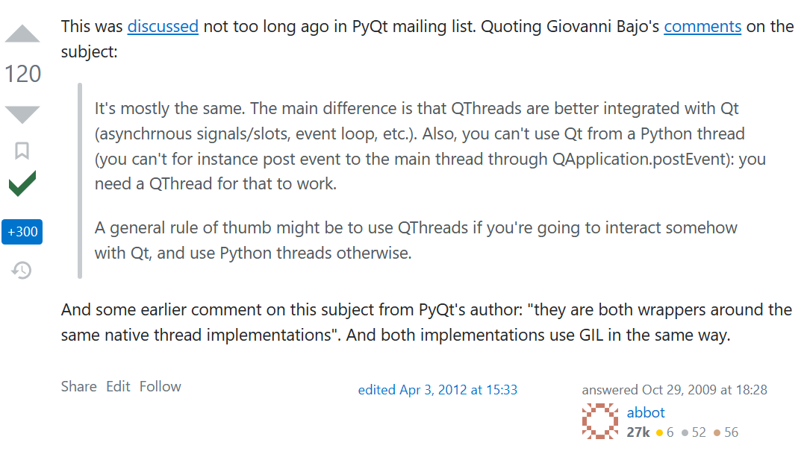

> 旧文

## 前言


因为在网络上，特别是中文互联网上，关于Pyside6多线程的写法，特别是QThread的使用提及比较少，且较多使用不太推荐的写法，这篇博客主要是存下我自己参考的博客，希望对大家也有帮助。


## 一、QThread or Python libs[thread, process, ...]


在python中有多种实现多线程的方法，我一开始也纠结选哪种实现方式

在[Stack Overflow的这篇回答](https://stackoverflow.com/questions/1595649/threading-in-a-pyqt-application-use-qt-threads-or-python-threads/1645666#1645666)中，可以大致窥得答案：QThread在Qt开发中一体性会更好，其他差别不大。





### 补充资料


有位大佬写的[【QT】 Qt多线程的“那些事”](https://www.cnblogs.com/lcgbk/p/13967448.html)，虽然是Qt C++，但是也可以帮助了解Qt for Python。


## 二、QThread推荐实现方式 - moveToThread


在确定使用QThread后，发现[QThread - Qt for Python 官方文档](https://doc.qt.io/qtforpython/PySide6/QtCore/QThread.html)写得很一般，甚至给的example都不堪入目。


我在[Stack Overflow的文章](https://stackoverflow.com/questions/6783194/background-thread-with-qthread-in-pyqt/33453124#33453124)找到Pyqt5注释详细的实现，Pyside6的实现也就很类似，也很可以帮助理解QThread的建立过程，以及在[Python多线程之threading.Thread()基本使用](https://www.cnblogs.com/rainbow-tan/p/16305562.html)和[QT信号和槽在哪个线程执行问题](https://www.cnblogs.com/wangshaowei/p/8384474.html)的博客中，可以进一步浅尝实现的区别。


>   Stack Overflow文章的原文以及给出的代码实现


```
Take this answer updated for PyQt5, python 3.4

Use this as a pattern to start a worker that does not take data and return data as they are available to the form.

1 - Worker class is made smaller and put in its own file worker.py for easy memorization and independent software reuse.

2 - The main.py file is the file that defines the GUI Form class

3 - The thread object is not subclassed.

4 - Both thread object and the worker object belong to the Form object

5 - Steps of the procedure are within the comments.
```

```python
# worker.py
from PyQt5.QtCore import QThread, QObject, pyqtSignal, pyqtSlot
import time


class Worker(QObject):
    finished = pyqtSignal()
    intReady = pyqtSignal(int)


    @pyqtSlot()
    def procCounter(self): # A slot takes no params
        for i in range(1, 100):
            time.sleep(1)
            self.intReady.emit(i)

        self.finished.emit()


# main.py
from PyQt5.QtCore import QThread
from PyQt5.QtWidgets import QApplication, QLabel, QWidget, QGridLayout
import sys
import worker


class Form(QWidget):

	def __init__(self):
		super().__init__()
       	self.label = QLabel("0")

       	# 1 - create Worker and Thread inside the Form
       	self.obj = worker.Worker()  # no parent!
        self.thread = QThread()  # no parent!

        # 2 - Connect Worker`s Signals to Form method slots to post data.
        self.obj.intReady.connect(self.onIntReady)

        # 3 - Move the Worker object to the Thread object
        self.obj.moveToThread(self.thread)

        # 4 - Connect Worker Signals to the Thread slots
        self.obj.finished.connect(self.thread.quit)

        # 5 - Connect Thread started signal to Worker operational slot method
        self.thread.started.connect(self.obj.procCounter)

        # * - Thread finished signal will close the app if you want!
        #self.thread.finished.connect(app.exit)

        # 6 - Start the thread
        self.thread.start()

        # 7 - Start the form
        self.initUI()


	def initUI(self):
		grid = QGridLayout()
        self.setLayout(grid)
        grid.addWidget(self.label,0,0)

        self.move(300, 150)
        self.setWindowTitle('thread test')
        self.show()

	def onIntReady(self, i):
        self.label.setText("{}".format(i))
        #print(i)

        app = QApplication(sys.argv)

        form = Form()

        sys.exit(app.exec_())
```


>   下面是我自己再写的实现


```python
class Worker(QObject):
    ready = Signal()
    # 貌似finished信号，Qt自己有定义(?)
    finished = Signal()
    def __init__(self):
        super().__init__()
    def DoWork(self):
        # 或者设置一个变量作为是否停止的标准，然后用某一个槽函数修改它即可
        while True:
            # print('hello, QThread')
            self.ready.emit()
        self.finished.emit()

class ...:
    
    def __init__(self):
        super(..., self).__init__()
        
        self.worker = Worker()
        self.workerThread = QThread()
        self.worker.moveToThread(self.workerThread)

        self.workerThread.started.connect(self.worker.DoWork)
        self.worker.finished.connect(self.workerThread.quit)
        self.worker.ready.connect(self.xxx)

        self.workerThread.start()
    
    def xxx(self):
        pass
```

## 其他小问题

中途有遇到将`信号(Signal)`在`实例(self)`上定义是不行的错误。

在[关于python：’PySide.QtCore.Signal’对象没有属性’connect’](https://www.codenong.com/36559713/)末尾有提到，需要将`信号(Signal)`定义在`类(class)`上。


### UPD - 2023.2.15

根据一些文章的对最终槽函数在哪个线程运行的分析，应该还是把要运行的槽函数定义在`Worker`类里的样子，关于UI的修改是要在主线程中进行。