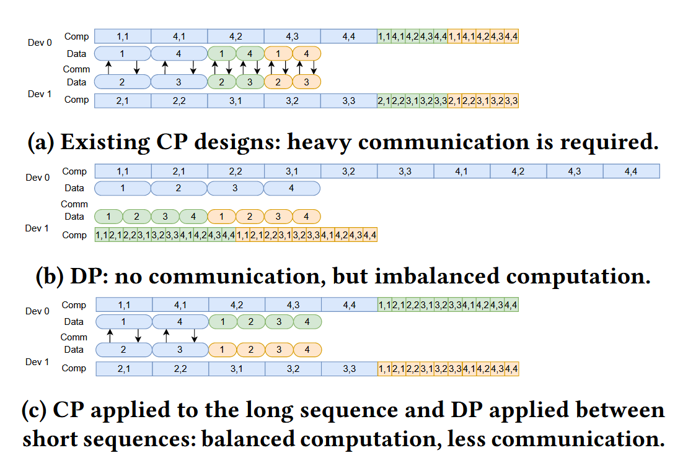
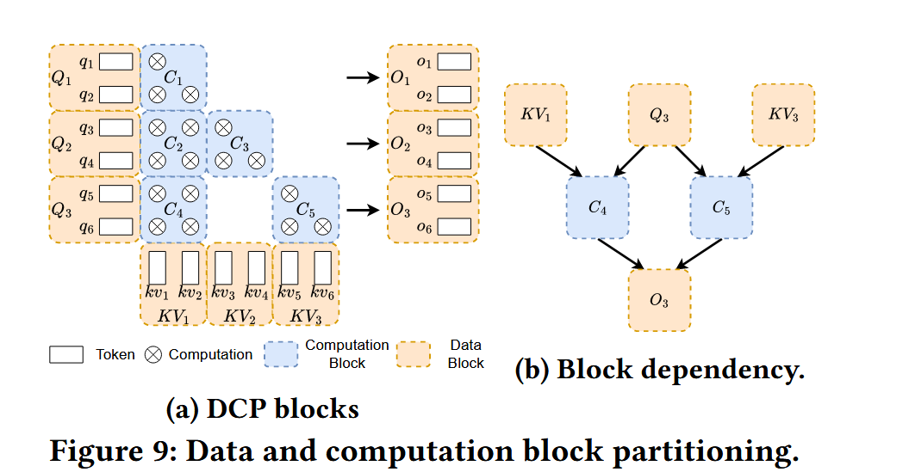
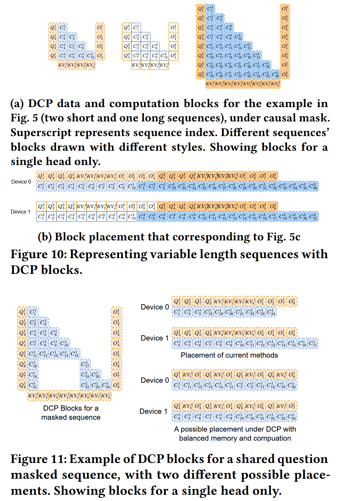
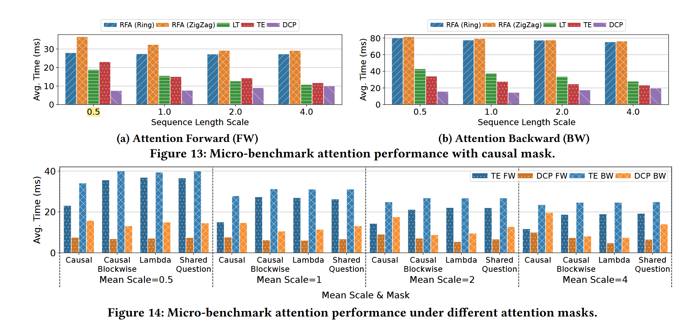
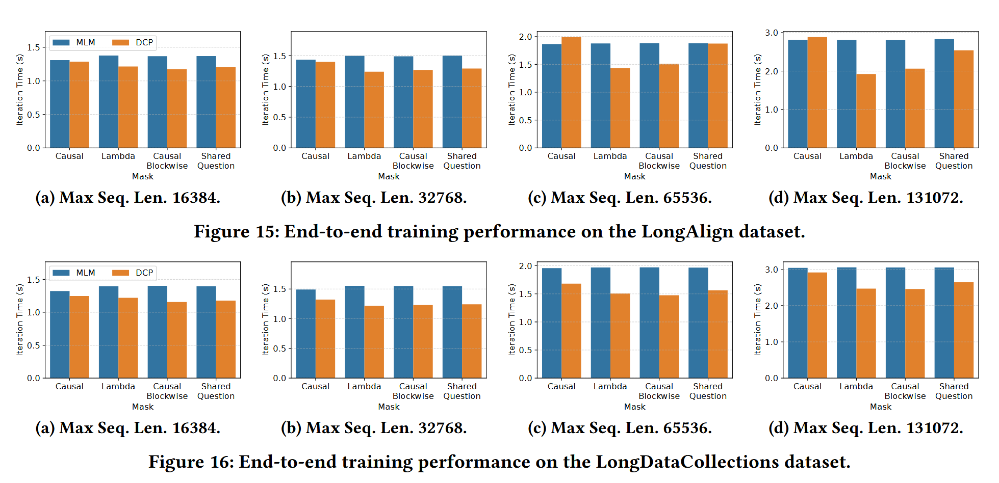
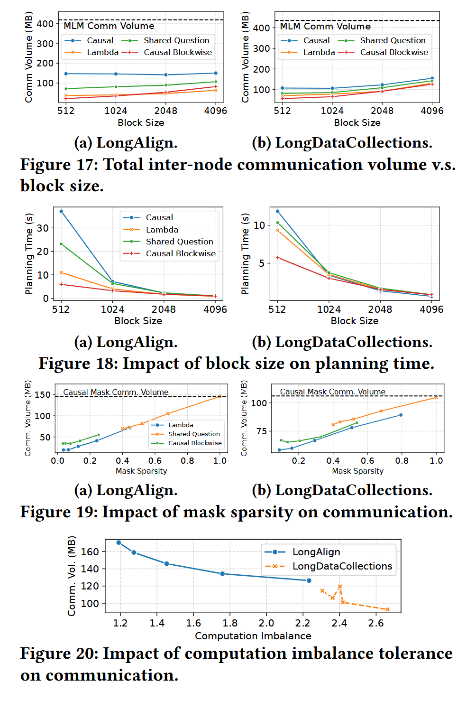

> 封面来源：[@UMEDAYO_sekaume](https://x.com/UMEDAYO_sekaume/status/1993233124218880125)

> tags: #rg/ContextParallelism #rg/TrainingSystem #rg/VarlenSeq #rg/SparseUsed
## Motivation

实际常见的 **seq varlen**，**token relationship** (sparse) 下，static 的 CP，效果不好。

## Background

- 分块的 attention 计算
- Context Parllelism，ulysses, SP, ring attention, ring attention (head-tail)，等 placement 的优化。
- varlen，虽然内存、计算是均衡了，通信是冗余的，不管长短都要通信。可以 CP 长，DP 短，见下图。
- token relationship，在多样任务下的多种的 mask，会把不下一个 / 其他 device 用不到的  kv block 给传输过去。

有/无序列依赖的算子。

## Method

1. 块表示。
	- 根据 mask，把 data，分析作为单 head 的 Q, KV, C, O（C 指计算块） 的 **block** 来分析，求解 memory 和 communication 的均衡解，即 placement。
	- Q, KV, C, O 块之间存在依赖。
2. 超图划分。
	- 考虑到 inter- 通信效率不如 intra-，自然进行层级 placement。
	- 根据这些计算、内存、通信等限制条件，汇总为总的**计算不均衡容忍度**与**内存不均衡容忍度**，把求解最优分配问题，转变为**均衡 Hypergraph 超图划分问题**。
	- 这是个 NP-hard 问题，使用高效的启发式求解器，PaToH, KaHyPar。
3. 计算通信调度。
	- 因为块的计算顺序是无关的，顺序执行可能不能充分利用硬件性能，即不能够很好的 overlap 通信与计算，所以提出**多划分执行调度**。
	- 目标是，将计算块划分到 T 个阶段，最小化每个 device 上的最大计算 / 通信。
	- 相当于是一个**多维分配问题**的 NP-Complete 问题，使用贪心启发式的方法找到均衡的划分。
	- 每个阶段计算的通信不超过 1 / T，从无需通信开始。
4. 执行器。
	- 核心是**块缓冲**和**指令集**，包括块注意力（输入输出块分布可能不连续，所以魔改增加 offset，与 FlexAttn, FlashMask）、块规约、块拷贝、通信启动、通信等待。
5. 其他
	- plan 和 model execution 做 overlap，dataloader 预取数据。
	- 与其他并行策略，可以 DCP 应占据 TP-CP-DP-PP 中（CP-DP）的分配顺序。

## Experiment

1. Mirco-benchmark (attention op)
   设置：在 4 个 AWS EC2 p4de.24xlarge（32张A100 GPU）上，使用 LongDataCollections 数据集，比较 DCP 与 RFA、LoongTrain、TransformerEngine。

2. End-to-end eval
   设置：在 8 个 AWS EC2 p4de.24xlarge 实例（64 张 A100 GPU）上，使用 LongAlign 和 LongDataCollections 数据集，训练 8B 参数 GPT 模型，比较 DCP 与集成在 Megatron-LM 中的增强版 TransformerEngine。

3. 其他
   块大小与通信量、plan 时间、稀疏度的关系，计算不均衡容忍度与通信量。

## Future

做 training，plan 可以有效被 overlap；

如果做 serving，plan 取 1024 大小，需要 10s 不太可用；

先考虑 prefill，但比如如果我是提前为几种常见的 sparse 类型去做预处理，

或者找最类似的情况选 plan，注意 data 均匀（不影响非序列依赖算子的计算量），可能大概还行？

再考虑 decode，q = 1 的话，q block 实际没有了。