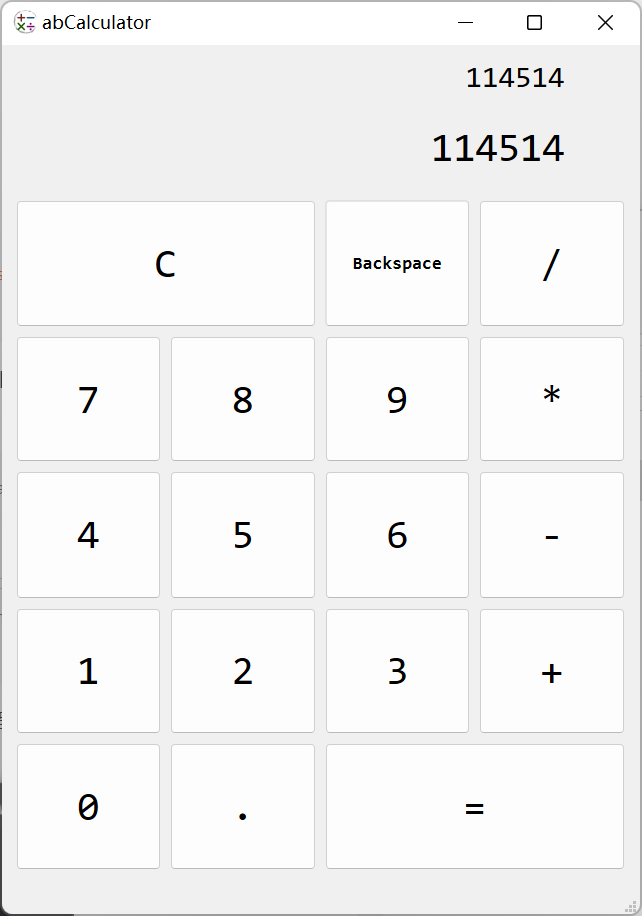

> 旧文

## 开发环境

Python3.10, Pyside6

##  使用界面、源码与不同之处

[abCalculator](https://github.com/Livinfly/abCalculator)



界面没有很不一样，不同可能体现在键位上。

为了有与优秀的小键盘来计算一样的舒适，在保留原有普通键位的基础上，还增加了魔改键位（详见Github）

## 遇到的问题与解决方案

> 具体实现都见Github源码

- keyboard添加热键，把快速连续按不同的热键，识别成新的热键，导致输入缓慢
    - 一个热键触发后，采用keyboard.stash_state()清空

- 当前窗口为未活跃状态（不是系统聚焦的窗口），热键仍响应
    - `[创建的窗口实例/self].window().isActiveWindow()`和`[创建的窗口实例/self].window().isMinimized()`可以判断窗口是否活跃
    - 热键调用的函数用匿名函数lambda，匿名函数内再调用一个函数，加入条件判断后，再执行我们需要的函数
- 输出过长，导致窗口显示不下
    - 把实际的内容和显示的内容分开想，我这里采用只取实际内容的后十几位作为显示内容
    - 或可以采用QLineEdit，加上样式`background:transparent;border-width:0;border-style:outset;`
    - 亦可以采用QtQuick

## 其他

```python
# PySide6-uic DemoUI.ui -o DemoUI.py
# from DemoUI import DemoUI

# self.ui.__Action__.triggered.connect(__Function__)
#           Button   clicked
#           ComboBox currentIndexChanged
#           SpinBox  valueChanged
# 自定义函数.属性名.connect

# 此窗口是否活跃
# self.window().isActiveWindow()
# self.window().iMinimized()
```