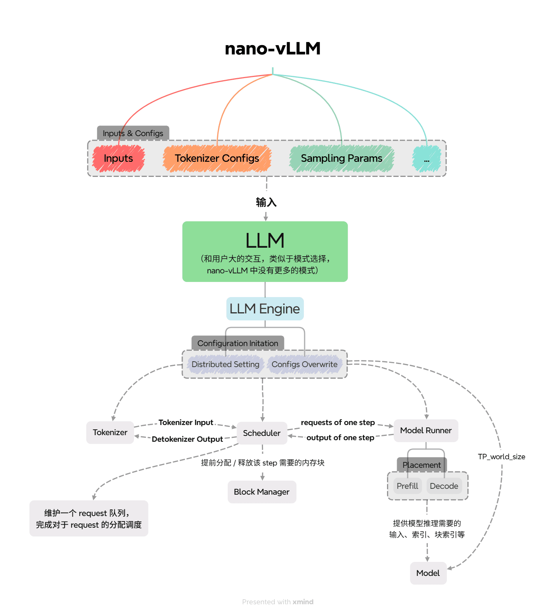

> 封面来源：[@takeez3](https://x.com/takeez3/status/1958149162303930704)

> nano-vLLM 作为 Python 简洁实现的朴素 vLLM，对 vLLM 的主要结构能有一个简单的认识。

> 项目代码简洁，除了少数几个地方变量可能需要琢磨下，其他地方阅读通畅，非常建议阅读源码！

仓库代码：[GeeeekExplorer/nano-vllm: Nano vLLM](https://github.com/GeeeekExplorer/nano-vllm)
我 fork 的带有少量英文注释的仓库代码：[Livinfly/nano-vllm at private/mengmm](https://github.com/Livinfly/nano-vllm/tree/private/mengmm)

相关文章：
- 附代码注释
	- [nano vllm Sequence 以及 BlockManager 解析 - 知乎](https://zhuanlan.zhihu.com/p/1939065889937929048)
	- [nano vllm Scheduler、ModelRunner以及LLMEngine 解析 - 知乎](https://zhuanlan.zhihu.com/p/1940531910418862756)
- [nano vllm源码阅读——TP并行 - 知乎](https://zhuanlan.zhihu.com/p/1925942233745585068)

目前 nano-vLLM 仅支持单机多卡 TP。

config 为了简洁，基本是硬编码。

下面将按照文件结构进行介绍，对照上图阅读。

## entrypoint

最初可以先看 `example.py`、`bench.py`，了解配置、参数流的传输路径。

经过形式上的 `llm.py` 进入 engine。

## engine

### LLM Engine

从 `__init__()` 或者 `generate()` 看起，下面为了介绍方便，从 `__init__()` 开始介绍。

LLM Engine，具体由以下几部分组成，他们的初始化在 `__init()` 中完成。

- `config`
	- 模型、kv cache、分布式并行、调度等相关配置。
- `multiprocessing` 分布式配置
	- 主要是启动了多个执行 `ModelRunner` 的进程，后续用于做单机多卡的 TP。
	- 基本逻辑见后续 `step()` 中。
- `Model Runner`
	- 模型运行的执行者。
	- 主进程，拥有所有其他 GPU 的 `event`。
	- `event`，因为不是很懂分布式，可以简单理解成给主进程了个调用的方式。
- `Tokenizer`
	 - 分词器，用于 `text` 文本和 `token_ids` 词元编码的编解码，简单理解成人类的语言和大模型的语言相互翻译。
 - `Scheduler`
	 - 调度器，负责调度模型处理的请求。

然后，我们看外界调用的接口 `generate()`，收起忽略掉 `if use_tqdm:` 的 debug 调试信息，核心逻辑如下。

1. 把新请求的 `prompt` 请求加入调度器的队列。
   具体地，在正式加入调度器之前，会使用 `Tokenizer` 进行编码，转变成适合模型处理的形式。
2. 加入完毕，逐个 `step` 处理出完成的结果 `output`，增量更新整体的结果 `outputs`。
3. 返回 `text` 和 `token_ids`，作为结果和方便调试的输出。

接下来，我们看具体处理输出的函数 `step()`。

1. 先用我们先前加入 `prompt` 的 `Scheduler` 进行 `schedule()` 调度，得到本次 `step` 需要处理的 `seqs` 序列，即需要处理的请求；同时返回本次 `step` 处理的序列的类型，是 prefill 还是 decode。
2. 传入 `model_runner`，`call` 分布式调用 `run`，模型处理出本次输出的 `token_ids`。
3. `Scheduler` 把新生成的 `token_ids` 加入 `seq` 中，并且对 `seq` 生成是否结束做出判断，同时进行对应的更新。
4. 把生成结束的 `seq` 返回为 `output`，同时输出测试使用的 `num_tokens` 表示处理了多少个 `token`。

至此，整个框架的主要结构、流程已经介绍完毕，接下来将是一些细节上的实现。

### scheduler

我们由主要逻辑 `generate()` 出发，首先了解 `scheduler` 的实现细节。

首先从 `__init__` 开始。

- 涉及到一次能调度多少 `seqs`、`tokens` 的配置
- `Block Manager`，设置好 `num_kvcache_blocks`、`kvcache_block_size`，后续在调度过程中，判断 kv cache 是否够分配，分配、回收块的内存。
	- `num_kvcache_blocks` 在 `scheduler` 初始化前的 `model_runner` 初始化的时候确认的。
- 调度序列
	- waiting 等待调度序列
	- running 运行中序列（处理过，有 kv cache）

核心逻辑 `schedule()`。

1. 调度 prefill
	- 对 `seq` 进行 kv cache 分配的可行判断，分配。
	- `seq` 状态的更新，`schedule` 调度序列的更新。
	- 如果存在 prefill 的 `seq` 调度完，直接返回，prefill 优先，一次调度只调度一种计算类型的 `seq`。
2. 调度 decode
	- 显然只有 prefill 调度完了，或者放不下了，才会到 decode
	- 对 running 的序列做进一步处理
	- 判断是否可以 append，即 decode 后生成一个 token 的内存占用
	- 不能就 `preempt()` 抢占后续 running 中的 `seq`，供自己使用
		- 具体地，抢占就是把 `seq` 放回 waiting 中，释放它的 kv cache。
		- 如果没有能再抢占的序列了，还是不能满足它，则结束 decode 的调度。
		- 特别地，如果此时没有一个 `seq` 被调度，则报错。
	- 可以就正常分配内存。
3. 把新调度的 `seq` 放到 `running` 的最前面。

scheduler 调度策略是原 vLLM v0 的默认策略，只支持一个 step prefill 或 decode。
具体地，nano-vLLM 优先 prefill，抢占式调度。

### block_manager

既然 `scheduler` 中有提到 `block_manager`，因为都是很硬的内存分配、共享块的代码，比较琐碎，简单带过。

为了能减少内存碎片，进行 share-prefix 前缀共享，`Block` 涉及了 hash, ref_count。

具体的内存分配的话，就是先判断能不能，然后再具体分配；追加到最后的块里，还是新开辟一个块。

### sequence

琐碎，同样简单带过。

为了序列化、反序列化传输方便，只有必要的序列信息和与块相关的信息。

### model_runner

`__init__()`
- 模型载入
- 分布式的通信的配置
	- 前面提到的 `call` 调用 `run` 的具体实现，就是主进程监听 `step()` 的 `call`，收到后广播给其余进程，具体是通过进程 Shared Memory 共享内存，来写、读的。
	- 模型的 TP，在配置完 rank、world_size 后，在模型结构侧自动进行切分。
- Sampler
	- 最后模型输出概率的采样器
- warmup，找到模型运行的峰值内存等信息
- allocate_kv_cache，根据 warmup 得到的内存信息，进行分配 kv cache。
- cuda graph 相关设置（我目前只知道，会 padding）

首先先来看下，`allocate_kv_cache()`，逻辑简单。

- 根据模型信息、本地内存信息、TP 信息，算出合理的 `config.num_kvcache_blocks`
- 分配当前 rank 模型的 kv_cache，同时绑定到 / 被引用，每层 attention 的 k_cache, v_cache 中。

然后，我们看核心 `run()`。

1. `prepare_(prefill / decode)`，为 `run_model` 准备上下文，`input_ids` 新增 token 和 `position` 位置编码，同时，`prepare_block_tables` 在 Q 和 KV 没对齐的时候，block 长度对齐。
2. `prepare_sample`，为每个 seqs 确定采样 temperature
3. `run_model`，运行模型，算出 logits
4. `sample`，采样出 token_ids

## layers

都是一些算子的实现，主要提以下几个：

- `attention`，k 和 v 在forward 时候，在进入 attention 算子计算前，进行存储。
- `QKVParallelLinear`，`ColumnParallelLinear`，`RowParallelLinear`，涉及 TP，Q / K / V/ O 的运算。

## models

模型具体并行涉及 TP 相关知识，核心层在 `QKVParallelLinear`，`RowParallelLinear`，可以参考 [nano vllm源码阅读——TP并行 - 知乎](https://zhuanlan.zhihu.com/p/1925942233745585068)

模型 loader 有些转化，看 `Qwen3ForCausalLM.packed_modules_mapping` 和 `utils.loader`。

模型结构比较简单，到最后会回到我在 layers 中提到的几个核心算子。