> 大部分就是对书里的简单摘记。

## 摘记

- 开发新技术的能力，而且也知道为这些技术创造市场和寻找客户的方法。
- 坚信公司发展的唯一途径是把它作为一个品牌。
- Sonus（声音，拉丁语），Sonny Boy（小男孩）
- 大贺典雄与盛田的故事，指出早期磁带录音机的问题。
- 一旦某个建议被采纳，提出这个建议的人就要承担这个任务。
- 自己研发和生产关键零部件。
- CD的容量，不是没有逻辑的60，120 min，而是放下世界顶尖歌剧的时长，74 min。（围绕产品讲故事，以及品牌故事）
- 定期的设计评论会，鼓励设计师主动提案。
- TV-501 Mr.Nello 有趣的设计与命名，显像管可以旋转，方便睡觉看。
- 确实很多先于时代的创新，简约银黑设计也是经典。
- 漫画之后，便是产品设计选集了,不少设计毫不过时。
- （随眼缘随机选一些）
- HB-101 (1984) 家用电脑 的键盘 + 摇杆的形式，第一次见这种形式的 PC，何尝不是macbook“无头骑士”，扩展卡带也可以直接插
- 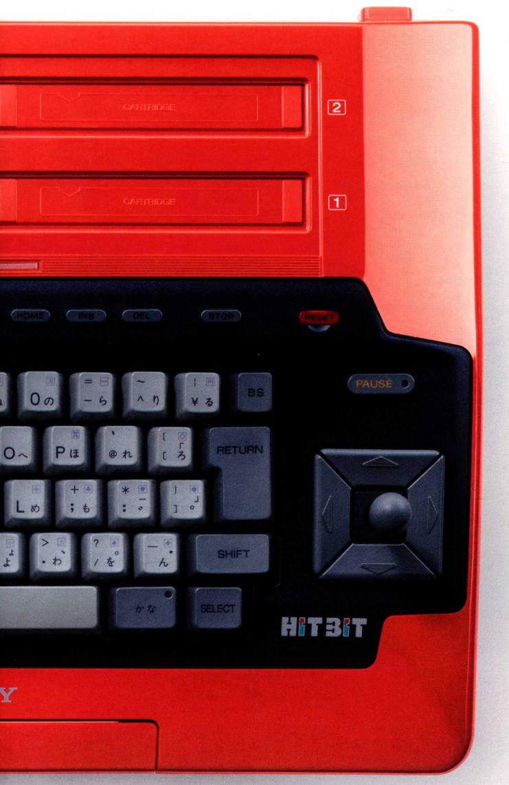
- WM-2 (1981) 有点帅的，包括 walkman 的字体。
- 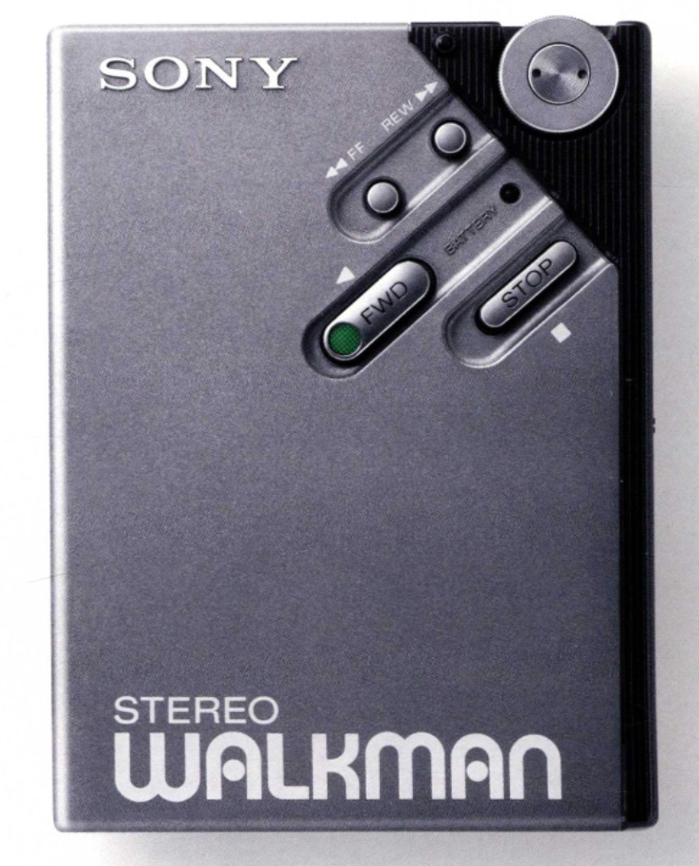
- WM-EX1 (1994)
- 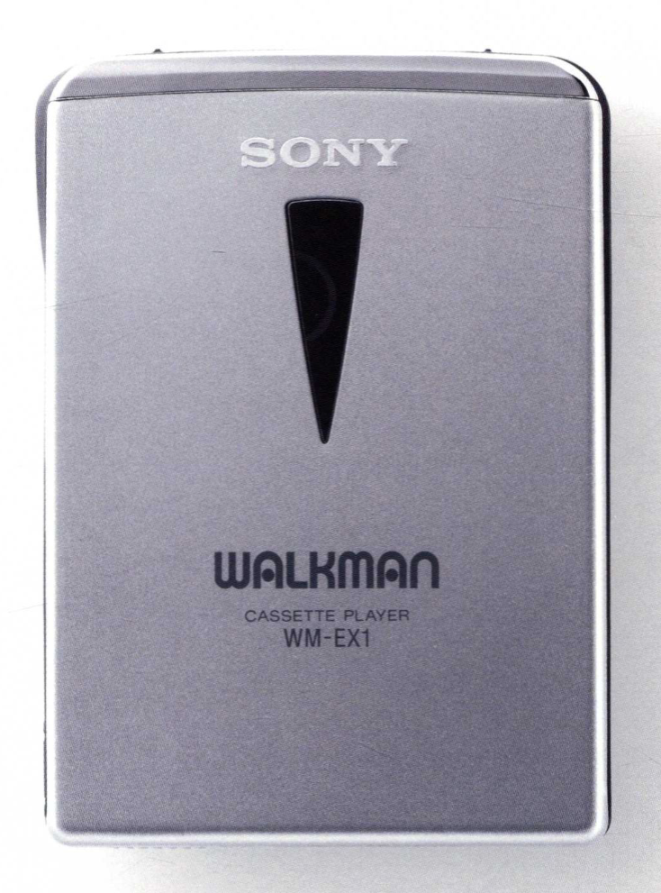
- my first sony (1987) 有点可爱
- 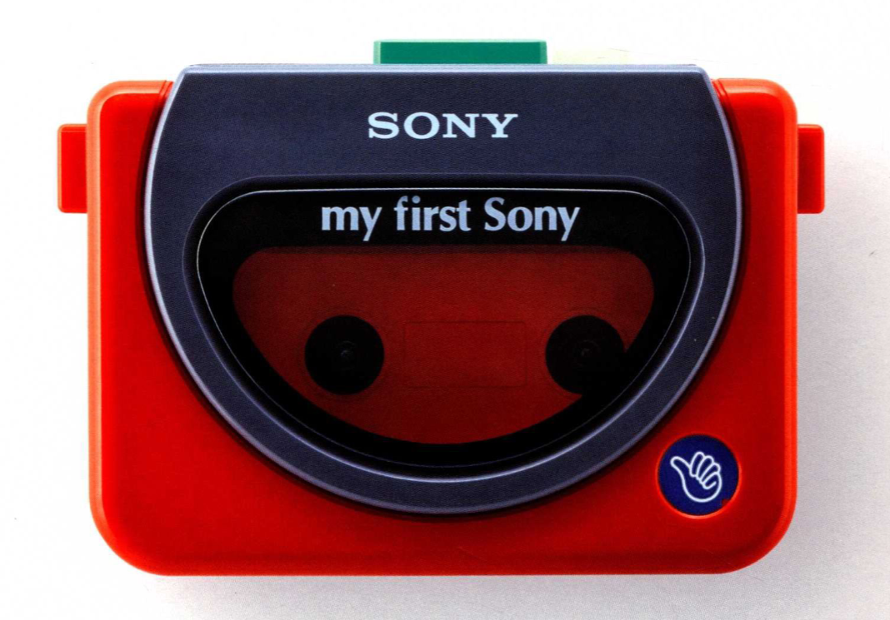
- D-50MK2
- 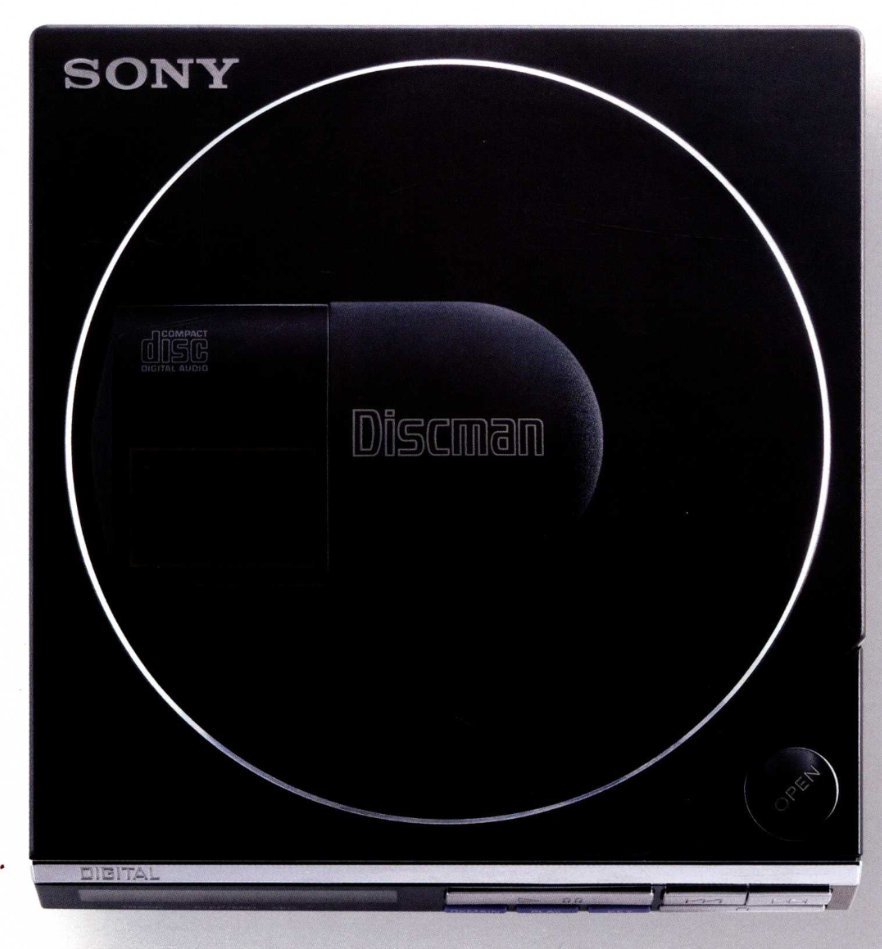
- D-SJ301 神秘 CD 播放器
- 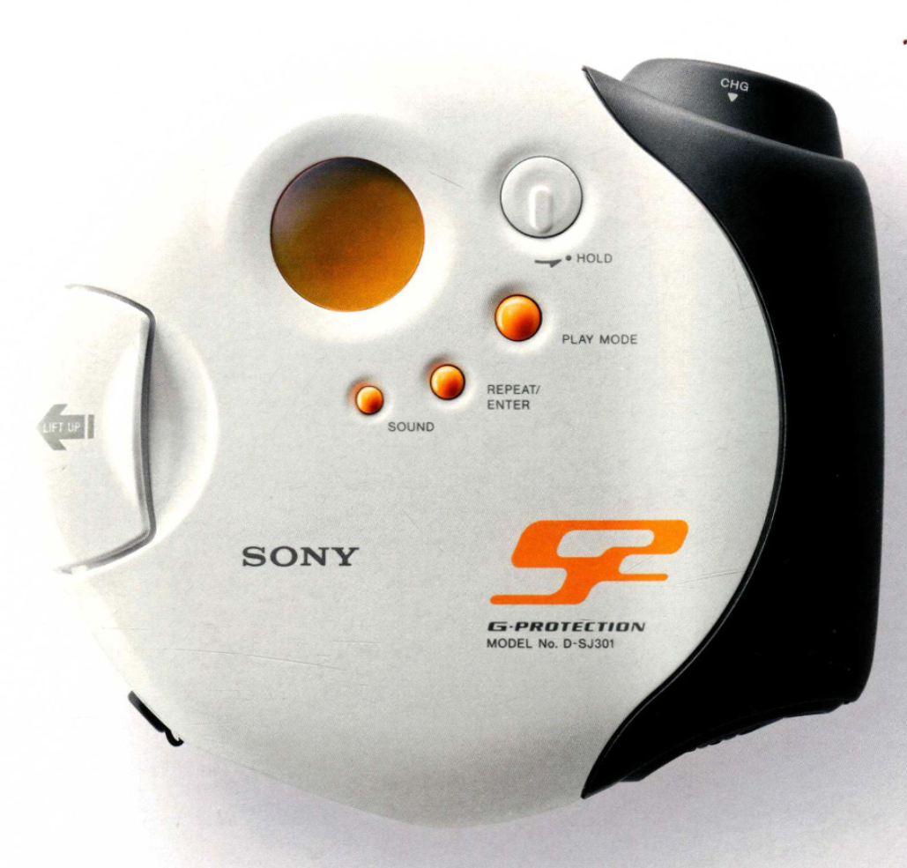
- NW-A1000 (2005)
- 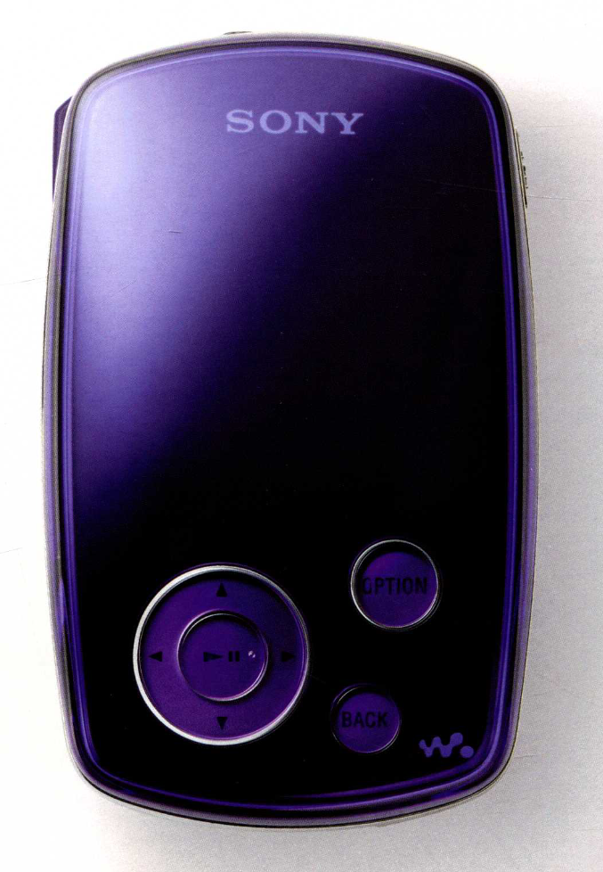
- NW-S203F (2006)
- 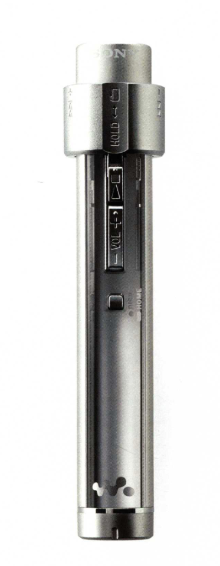
- NW-MS70D (2003)
- 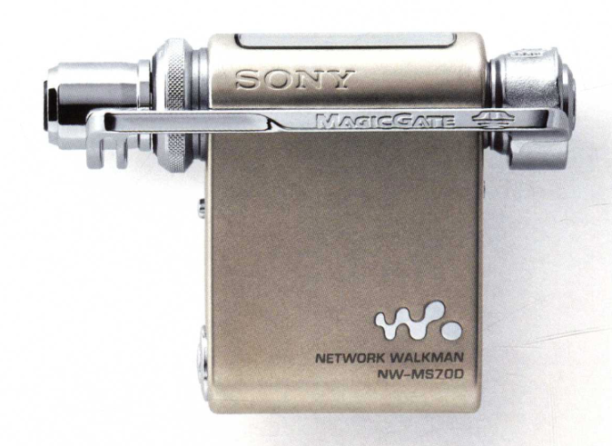
- MDR-E484 (1988)
- 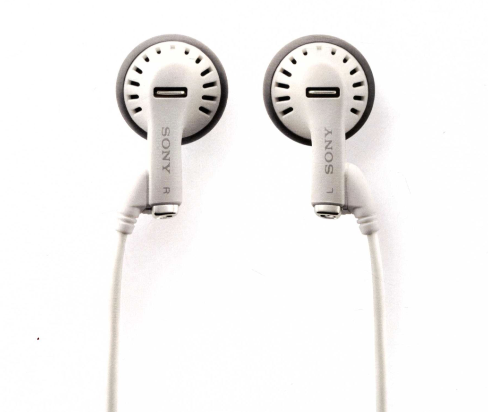
- DSC-T700 (2008)
- 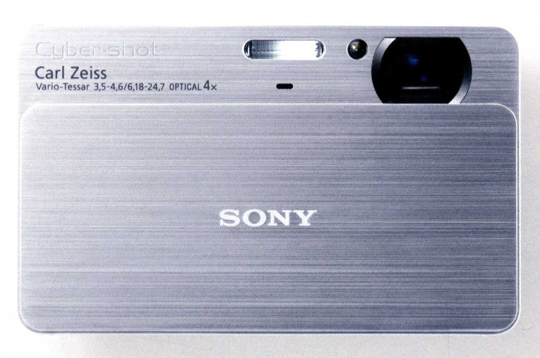
- SCPH-90000 PS2 (2000)
- 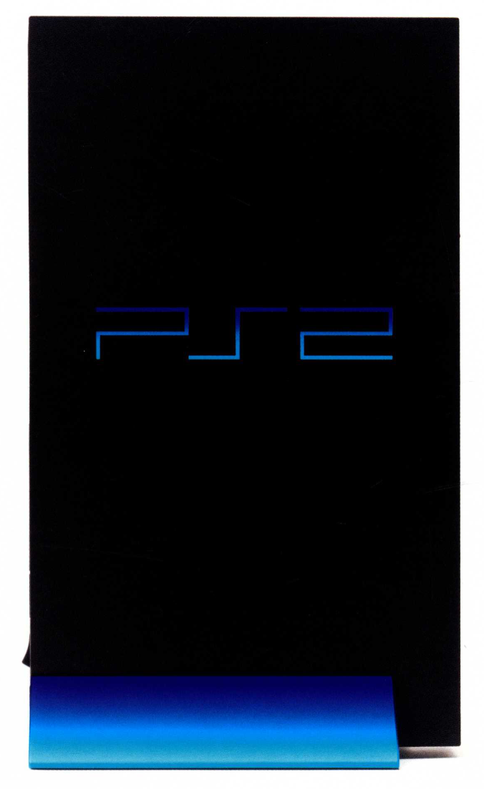
- PSP-1000 (2004)
- 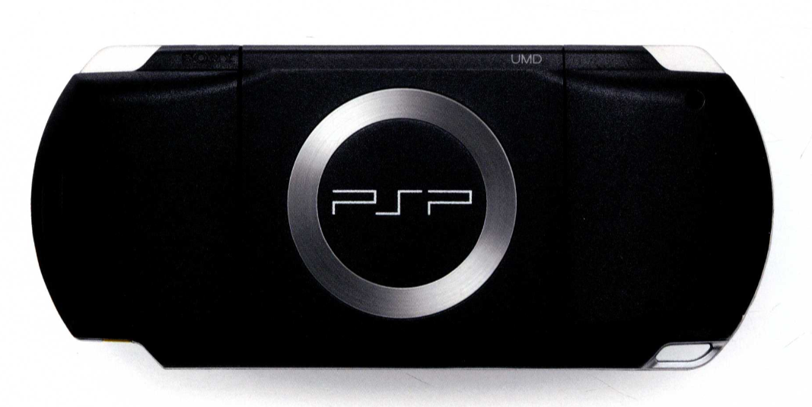
- SDR-4X II (2003)
- 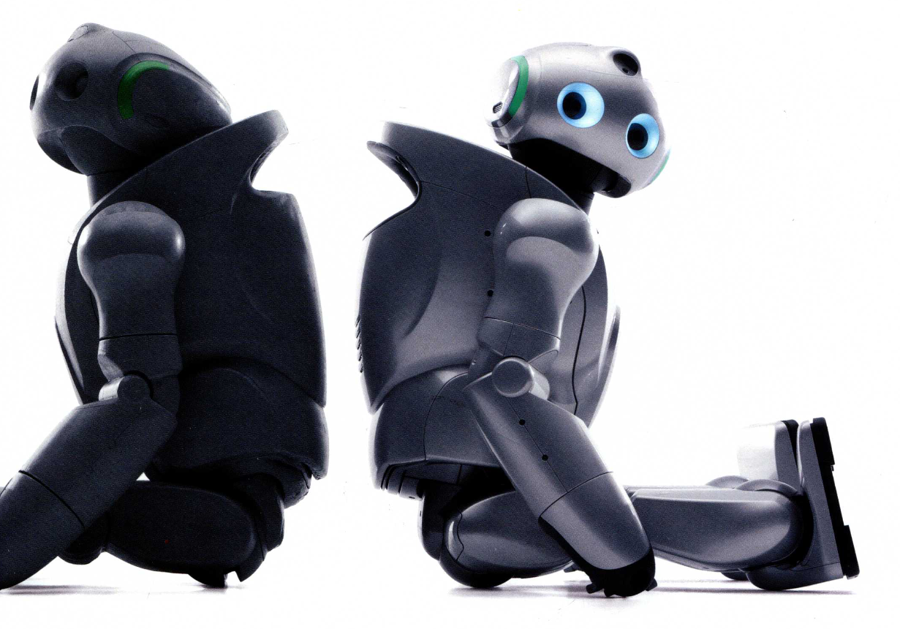
- SEP-10BT (2007)
- 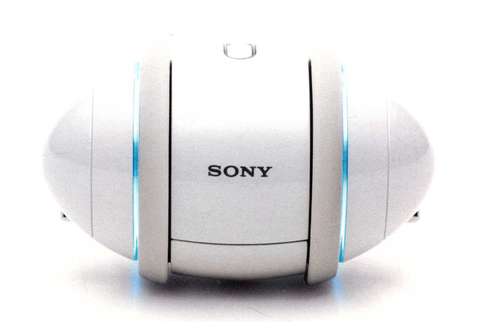
- ERS-7 (2003)
- 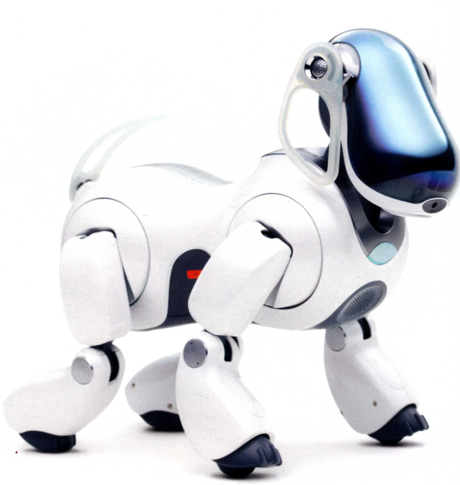

## 后感

后面对索尼的发展历程想再了解一些，简单过了下 [从叱咤全球到卖大楼，索尼究竟经历了什么？【生意03】哔哩哔哩 bilibili](https://www.bilibili.com/video/BV1hS4y1p7DL/)。

从发展顺序来讲吧。

我认为是天胡开局，技术、资金、人脉、创始人眼界、国际形势，都是很好的。

当时电子消费品刚刚起步，商品的全球化还没那么深刻，索尼从战后的「遗产」中拣出收音机发家，后面几次重要技术突破，很大程度上是因为创始人背后的家族资金能够兜底，方向没错，坚持下来了，就是先进领先。创始人的品味、背景在早期成功中占了很大的部分。

然而在正式脱离第一代创始集团的掌控后，包括消费电子逐渐从硬件中心转为软件中心以及软硬融合的时候，在互联网高歌猛进的时候，索尼就没有很好的人才，并且内部存在转向的难度，曾经老创始人的绝对话语权，到新一代领导人上也显得弱了许多。

再是老创始人被投其所好的人，跨级直接交流，个人喜好导致公司数个大的决策失误，纵使有无数资金，但是逐渐陷入泥沼，最后只能删裁求生。

后续想要继续看看讨论大的公司、组织，甚至国家的形式，关于长期发展的可能、方法的探讨的资料。