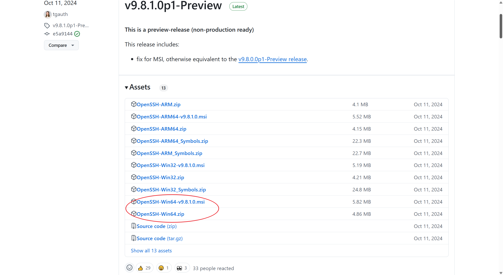
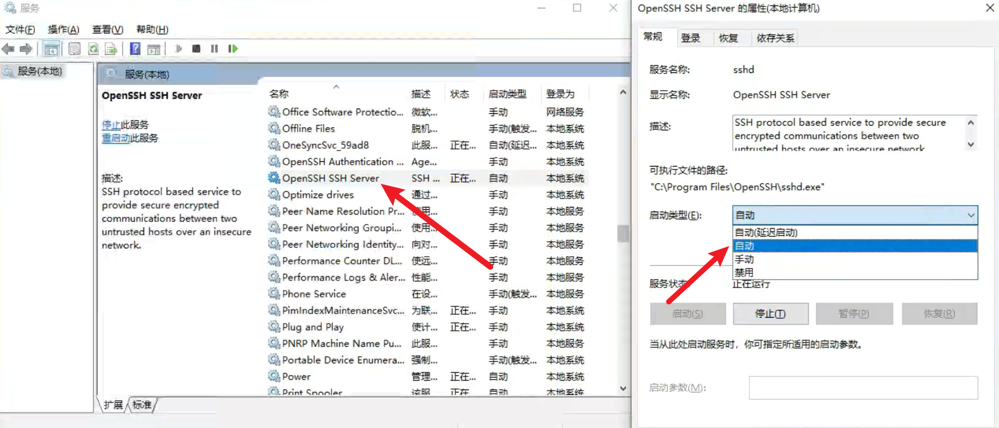
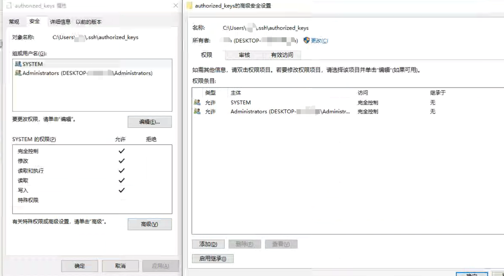
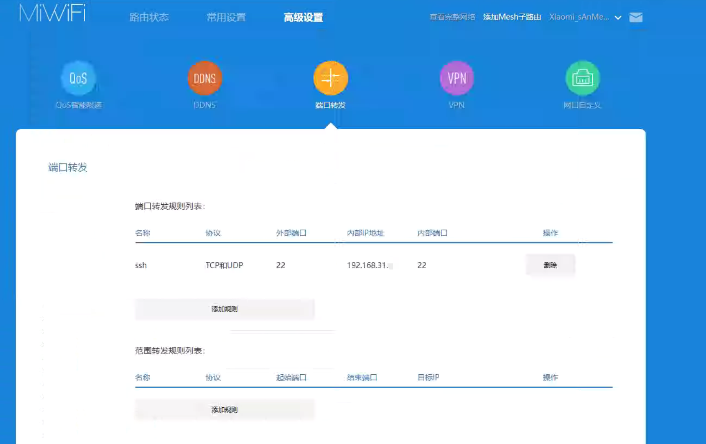

## 背景

在外上学，家里的台式机本来是要用到的话，使用`小米智能插座`+`台式机通电启动`+`远程控制软件ToDesk`~~来逃课~~，完全不涉及更深的技术，满足轻度外出调用电脑的需求。

最近又想折腾下`ssh`连接，一方面，`ToDesk`白嫖，有时候还是会卡几下，另一方面的话，可能就是随性想要搞一下了。

## Windows 开启 ssh

### 安装 OpenSSH

先到下载[OpenSSH](https://github.com/PowerShell/Win32-OpenSSH/releases)，选择自己对应的版本，我是64位，就选了圈出来的`zip`。



下载好后，解压在`C:\OpenSSH`，以`管理员身份`打开`终端`（PowerShell 和 CMD 应该都行）运行`install-sshd.ps1`，若已经手动把`OpenSSH`的路径添加到`环境变量`中的话，可以直接运行，否则请先移动到`OpenSSH`或用绝对路径运行`install-sshd.ps1`。

如果是`msi` 文件的话，应该也是类似的安装流程。

### 启动 ssh 并自动生成初始配置文件

在`终端`启动服务`Start-Service sshd`。

注意，在此之前不要在`C:\ProgramData\ssh\`下去创建修改`sshd_config`，否则，初始配置文件不会覆盖你创建的文件。

```
启动服务：Start-Service sshd
查看状态：Get-Service sshd
关闭服务：Stop-Service sshd
重启服务：Restart-Service sshd
```

### 防火墙开放 ssh 所用的端口

开放防火墙指定端口，比如默认的 22

具体参数，可按自己的需求配置

```sh
# 以`管理员身份`打开`终端`
netsh advfirewall firewall add rule name="sshport" dir=in protocol=tcp localport=22 action=allow
```

### ssh 服务自启动设置

进入`Windows`的`服务`页面，找到`OpenSSH SSH Server`，可按需要设置`启动类型`。



### 配置 ssh_config

#### 密码登录

在`C:\ProgramData\ssh\sshd_config`，我们可以看到自动生成的初始配置文件。

```sh
# 支持密码登录，把对应注释去掉，没有的话或者新添一行
PasswordAuthentication yes
```

#### 免密登录

但是，我的电脑账户是没有密码的，所以这里也介绍一下免密登录的设置。

我们先约定电脑 B 是我们想要 ssh 到的**服务端**电脑，电脑 A 是想要 ssh 到 电脑 B 的本地**客户端**电脑。

在电脑 A 先生成密钥（同样要先安装OpenSSH）

```sh
ssh-keygen -t rsa
```

生成密钥后，我们到`C:\Users\[your_userName]\.ssh` 下，找到公钥`id_rsa.pub`。

复制里面的内容，到电脑 B 的`C:\Users\[your_userName]\.ssh`创建`authorized_keys`（无后缀），并把前面复制的公钥内容，粘贴到里面。

再修改文件`C:\ProgramData\ssh\sshd_config`

```sh
# 下面这三行没有被注释
PubkeyAuthentication yes
AuthorizedKeysFile	.ssh/authorized_keys
# 若想要没有公钥，输入密码也可以访问的效果，可以设为 yes
PasswordAuthentication no

# 注释掉，不过看评论区，遇到相关问题的解决方案
# 可以把刚刚authorized_keys的内容，放到C:\ProgramData\ssh的administrators_authorized_keys里
# （同样新建文件，无文件后缀）
# 此时应该下面量化就不用注释了
#Match Group administrators
#       AuthorizedKeysFile __PROGRAMDATA__/ssh/administrators_authorized_keys
```

#### 重启服务配置生效

每次修改完配置后，记得重启服务，使得配置生效，`Restart-Service sshd`。

#### 其他

如过`ssh`时遇到`Permission denied (publickey,keyboard-interactive)`，可以尝试在`authorized_keys`文件的`属性`的`安全`中取消`继承`并只保留`system`与`administrator`。



### 测试登录

```sh
# your_userName是登录在电脑 B的用户名
ssh your_userName@your_IP_Address
# 如果不指定用户名，默认是电脑 A登录的用户的用户名，若没有增加其他配置，不能登录
ssh your_IP_Address
```

## 路由器端口转发

因为我的电脑 B 是连接路由器上网的，所以要访问到电脑 B 的话，只能发送给路由器。

以小米路由器为例，在路由器的`高级设置`中的`端口转发`，添加规则，内外端口映射根据自己需要修改，协议应该TCP就行（？），我偷懒直接都选了，内部 IP 地址，可以通过路由器的连接状况等方式查看。



设置完后，我们就向路由器的 IP 的对应端口发起 `ssh` 就行了。

## 总结

一股脑做完之后，想想还是有点用的，虽然因为没有静态 IP，需要先用`ToDesk`查看下现在的`IP`（当然，搞个自动化的启动后把路由器 IP 发送给我也不是不行，且确实有个类似的[项目](https://github.com/hzhu212/ip-reporter)，~~但是咕咕~~），不过，后面的使用就是直接对应着的了，稳定性高一点。

包括，其实顺便做了个挺抽象的事情，`ssh`到电脑 B 后，调用 `wsl`，逃课双系统（x

## 参考文献

[多台WIN10之间的SSH免密登录 - 余生](https://zhuanlan.zhihu.com/p/111812831)

[windows配置openssh server 支持Ipv4 Ipv6 - cddchina](https://blog.csdn.net/cddchina/article/details/122567824)