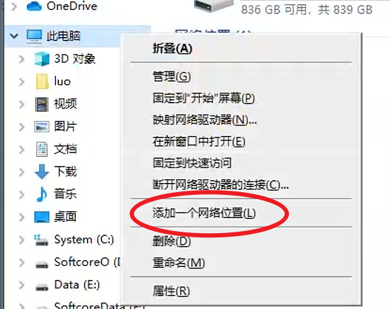
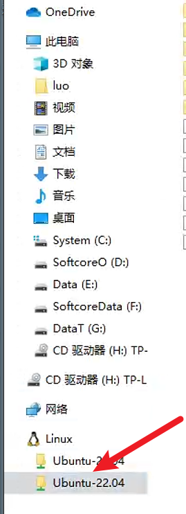
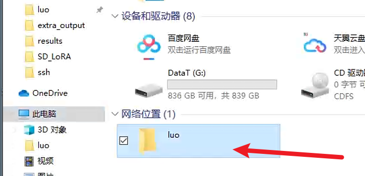
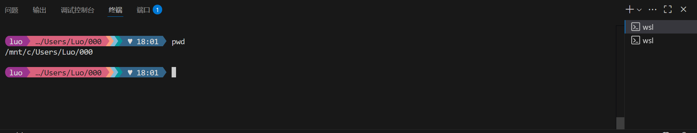

# WSL2 快速配置

>   封面来源：[@sasamik_](https://x.com/sasamik_/status/1947222609059606971)

因为近期又重复配 wsl2，干脆自己给自己列一下常见操作。

## Windows功能

开启虚拟化相关设置：Hyper-V, 适用于 Linux 的 Windows 子系统等，BIOS 打开虚拟化的设置。

重启生效。

注：如果遇到和虚拟化相关的报错（具体报错信息没有留），可能需要更新 wsl 版本，`wsl --update`。

```bash
# （以管理员打开 powershell 等）
# 启用适用于 Linux 的 Windows 子系统
dism.exe /online /enable-feature /featurename:Microsoft-Windows-Subsystem-Linux /all /norestart
# 启用虚拟化
dism.exe /online /enable-feature /featurename:VirtualMachinePlatform /all /norestart
```

## 安装 Linux 内核

```bash
# 查看本机有的 Linux 发行版
wsl --list
# 查看可安装的发行版
wsl.exe --list --online
# 安装，如 Ubuntu-22.04
wsl --install <DistributionName>
# 设置默认发行版
wsl --set-default <DistributionName>
# 查看 wsl 发行版本
wsl -l --all -v
# 卸载发行版
wsl --unregister <DistributionName>
# wsl 默认版本设置成 wsl2（可选）
# 注意：wsl2 读取挂载 /mnt 的文件，是通过网络通信的（smb协议）
# 不是 wsl1 的 IO，建议运行先转移到 wsl2 运行下
wsl --set-default-version 2
```

## 更改 wsl 的存储位置

```bash
# 查看 wsl 发行版本，后续的 Ubuntu-22.04 替换成你的发行版
wsl -l --all -v
# 导出发行版为 tar 到存储位置
# 注意：如果需要像我一样，放在某个文件夹下，需要先自己手动建立文件夹（在此命令下就是 wsl2 文件夹）
wsl --export Ubuntu-22.04 d:\wsl2\ubuntu22.04.tar
# 注销当前分发版
wsl --unregister Ubuntu-22.04
# 重新导入，刚刚导出的发行版，并且安装在xxx目录，这里是 d:\wsl2\ubuntu22.04，可以更改
# 如果前面正常设置了，这时遇到导入失败的问题，可以尝试更新 wsl
wsl --import Ubuntu-22.04 d:\wsl2\ubuntu22.04 d:\wsl2\ubuntu22.04.tar --version 2
# 设置默认登录用户名 sername 自选
ubuntu2204 config --default-user <username>
# 删除导出的 tar 文件（可选）
del d:\wsl2\ubuntu22.04.tar
# 设置默认发行版
wsl --set-default <DistributionName>
# 此时，d:\wsl2\ubuntu22.04 就是 wsl 的根目录了
```

## 建立网络位置访问

右键此电脑



添加类似于`\\wsl.localhost\Ubuntu-22.04\home\luo`的地址，具体可以在**资源管理器**界面的，Linux下访问 **wsl** 的文件目录，复制下来。



添加后的效果



## 设置代理

进入 wsl setting 设置 mirror（？）

允许本地局域网请求 Allow LAN 好像就行了

后面的可能不需要（？）

```bash
export http_proxy=http://127.0.0.1:7890
export https_proxy=http://127.0.0.1:7890

# git
git config --global http.proxy http://127.0.0.1:7890
git config --global https.proxy http://127.0.0.1:7890
```

## 安装常用环境

```cpp
sudo apt update
sudo apt-get update
sudo apt install gcc g++
```

-   本地 vscode 需要安装 wsl 插件，否则 vscode 上的文件列表更新不及时。

-   CUDA 根据[官方教程](https://docs.nvidia.com/cuda/wsl-user-guide/index.html) 安装 [CUDA](https://developer.nvidia.com/cuda-downloads?target_os=Linux&target_arch=x86_64&Distribution=WSL-Ubuntu&target_version=2.0&target_type=deb_local) （windows 下 Nvidia 显卡驱动）

    ```bash
    wget https://developer.download.nvidia.com/compute/cuda/repos/wsl-ubuntu/x86_64/cuda-wsl-ubuntu.pin
    sudo mv cuda-wsl-ubuntu.pin /etc/apt/preferences.d/cuda-repository-pin-600
    wget https://developer.download.nvidia.com/compute/cuda/12.9.1/local_installers/cuda-repo-wsl-ubuntu-12-9-local_12.9.1-1_amd64.deb
    sudo dpkg -i cuda-repo-wsl-ubuntu-12-9-local_12.9.1-1_amd64.deb
    sudo cp /var/cuda-repo-wsl-ubuntu-12-9-local/cuda-*-keyring.gpg /usr/share/keyrings/
    sudo apt-get update
    sudo apt-get -y install cuda-toolkit-12-9
    ```

## 给bash换皮肤（可选）

在 cmd 下的显示效果好像有问题，Powershell 还ok，vscode 的终端部分显示效果较好。

Starship 的 [Pastel Powerline Preset](https://starship.rs/zh-CN/presets/pastel-powerline) 皮肤，字体网站 [Nerd fonts](https://www.nerdfonts.com/font-downloads) 个人是用 **Cascadia Mono**。

按照 [Starship](https://starship.rs/zh-CN/guide/) 安装 Starship，下面以 Linux 上的安装方式为例

```bash
# 下载 TOML 配置文件（也可以在上面网站上，点击 TOML 的下载链接 或 复制下来创建文件）
wget https://starship.rs/presets/toml/pastel-powerline.toml
# 若没有目标路径，先创建路径，-p 参数用于递归创建，这里可以省略
mkdir -p ~/.config
# 移动到指定路径并改名
mv pastel-powerline.toml ~/.config/starship.toml
# 安装 Starship，这步失败大概率是网络代理配置没配好
curl -sS https://starship.rs/install.sh | sh
# 按照安装成功后，显示的命令行方法，应用，这里给出 bash 的版本
eval "$(starship init bash)"
```



## 安装 zsh （可选）

```bash
# 安装 zsh
sudo apt install zsh
# 设置默认终端为 zsh，不要用 sudo
chsh -s /bin/zsh
# 安装 oh-my-zsh
# curl	sh -c "$(curl -fsSL https://install.ohmyz.sh/)"
# wget	sh -c "$(wget -O- https://install.ohmyz.sh/)" # 1
# fetch	sh -c "$(fetch -o - https://install.ohmyz.sh/)"
# 国内curl镜像	sh -c "$(curl -fsSL https://gitee.com/pocmon/ohmyzsh/raw/master/tools/install.sh)"
# 国内wget镜像	sh -c "$(wget -O- https://gitee.com/pocmon/ohmyzsh/raw/master/tools/install.sh)"

# 主题 powerlevel10k
git clone --depth=1 https://github.com/romkatv/powerlevel10k.git ${ZSH_CUSTOM:-$HOME/.oh-my-zsh/custom}/themes/powerlevel10k
# 中国用户可以使用 gitee.com 上的官方镜像加速下载
git clone --depth=1 https://gitee.com/romkatv/powerlevel10k.git ${ZSH_CUSTOM:-$HOME/.oh-my-zsh/custom}/themes/powerlevel10k

vim ~/.zshrc
ZSH_THEME="powerlevel10k/powerlevel10k"
source ~/.zshrc
# 配置
yyy1y1112211111n1
# 内置插件
ls ~/.oh-my-zsh/plugins

# autosuggestions 补全
git clone https://github.com/zsh-users/zsh-autosuggestions ${ZSH_CUSTOM:-~/.oh-my-zsh/custom}/plugins/zsh-autosuggestions
# 中国用户可以使用下面任意一个加速下载
# 加速1
git clone https://github.moeyy.xyz/https://github.com/zsh-users/zsh-autosuggestions ${ZSH_CUSTOM:-~/.oh-my-zsh/custom}/plugins/zsh-autosuggestions
# 加速2
git clone https://gh.xmly.dev/https://github.com/zsh-users/zsh-autosuggestions ${ZSH_CUSTOM:-~/.oh-my-zsh/custom}/plugins/zsh-autosuggestions
# 加速3
git clone https://gh.api.99988866.xyz/https://github.com/zsh-users/zsh-autosuggestions ${ZSH_CUSTOM:-~/.oh-my-zsh/custom}/plugins/zsh-autosuggestions

# zsh-syntax-highlighting 语法校验
git clone https://github.com/zsh-users/zsh-syntax-highlighting.git ${ZSH_CUSTOM:-~/.oh-my-zsh/custom}/plugins/zsh-syntax-highlighting
# 中国用户可以使用下面任意一个加速下载
# 加速1
git clone https://github.moeyy.xyz/https://github.com/zsh-users/zsh-syntax-highlighting.git ${ZSH_CUSTOM:-~/.oh-my-zsh/custom}/plugins/zsh-syntax-highlighting
# 加速2
git clone https://gh.xmly.dev/https://github.com/zsh-users/zsh-syntax-highlighting.git ${ZSH_CUSTOM:-~/.oh-my-zsh/custom}/plugins/zsh-syntax-highlighting
# 加速3
git clone https://gh.api.99988866.xyz/https://github.com/zsh-users/zsh-syntax-highlighting.git ${ZSH_CUSTOM:-~/.oh-my-zsh/custom}/plugins/zsh-syntax-highlighting

# z 文件夹快捷跳转
z xxx
# extract 解压任何压缩文件
x xx.tar
# web-search 搜索引擎关键字+搜索内容 google baidu bing

# 启用插件
plugins=(git zsh-autosuggestions zsh-syntax-highlighting z extract web-search jsontools)
```

## vim 配置 （可选）
```bash
# ~/.vimrc
" basic

syntax on
set showmode
set showcmd
set mouse=a
set encoding=utf-8
filetype indent on

" indent

set autoindent
set tabstop=4
set shiftwidth=4
set expandtab
set softtabstop=4

" view

set number
set relativenumber
set cursorline
set textwidth=80
set laststatus=2
set ruler

" search

set hlsearch
```

## miniconda（可选）

https://www.anaconda.com/download/success 找到对应的安装包

```bash
wget https://repo.anaconda.com/miniconda/Miniconda3-latest-Linux-x86_64.sh
# chmod 777 ./Miniconda3-latest-Linux-x86_64.sh
./Miniconda3-latest-Linux-x86_64.sh
```


## 参考文章

[WSL入门到入土 - 知乎](https://zhuanlan.zhihu.com/p/682583573)

[Win10/11下安装WSL并修改WSL默认安装目录到其他盘_wsl 设置目录-CSDN博客](https://blog.csdn.net/farer_yyh/article/details/133934904)

[zsh 安装与配置，使用 oh-my-zsh 美化终端 | Leehow的小站](https://www.haoyep.com/posts/zsh-config-oh-my-zsh/)